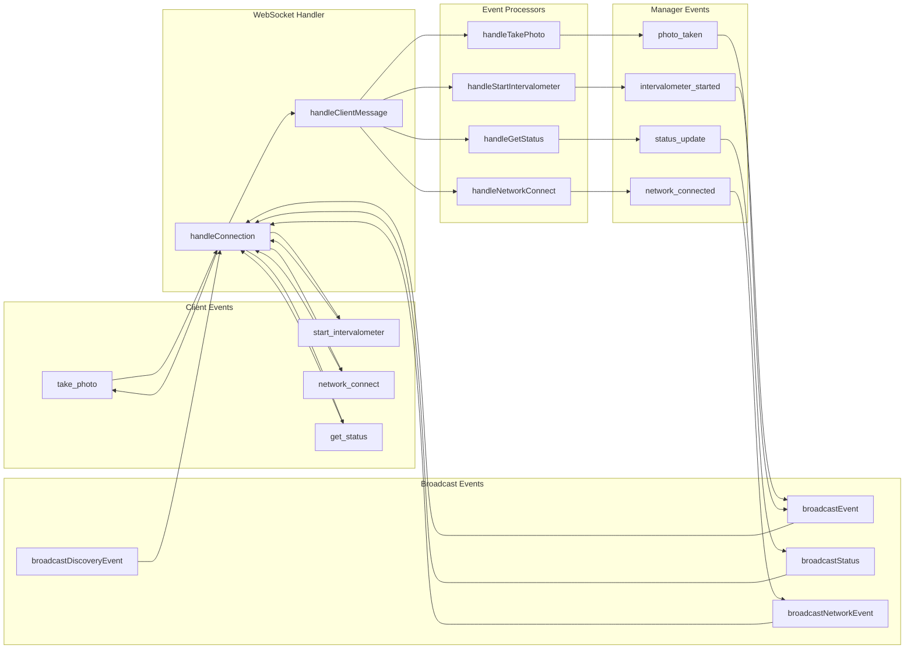

# API Specification

## Overview

The Pi Camera Control system provides a comprehensive REST API and WebSocket interface for camera control, network management, and system monitoring. The API is built on Express.js with 60+ endpoints and real-time WebSocket communication.

**Note**: This specification has been updated to reflect the current implementation. Known issues with multiple error response patterns and missing WebSocket message schemas are documented in the architecture overview.

## REST API Endpoints

### Camera Control

#### Get Camera Status

```http
GET /api/camera/status
```

Returns current camera connection status and basic information.

**Response:**

```json
{
  "connected": true,
  "ip": "192.168.4.2",
  "port": "443",
  "lastError": null,
  "shutterEndpoint": "/ccapi/ver100/shooting/liveview/shutterbutton/manual",
  "hasCapabilities": true
}
```

#### Get Camera Settings

```http
GET /api/camera/settings
```

Retrieves current camera settings via CCAPI.

**Response:**

```json
{
  "av": { "value": "5.6", "available": ["1.4", "2.8", "5.6", "8.0"] },
  "tv": { "value": "1/60", "available": ["1/30", "1/60", "1/125"] },
  "iso": { "value": "100", "available": ["100", "200", "400", "800"] }
}
```

#### Get Camera Battery

```http
GET /api/camera/battery
```

Returns camera battery status and information.

**Response:**

```json
{
  "batterylist": [
    {
      "position": "camera",
      "name": "LP-E17",
      "kind": "battery",
      "level": "85",
      "quality": "good"
    }
  ]
}
```

**Note:** Format matches Canon CCAPI v1.40 specification. The `level` field is returned as a string, not a number. Additional fields include `position` (camera location), `kind` (battery type), and standard `quality` values ("bad", "normal", "good", "unknown").

#### Get Camera Storage

```http
GET /api/camera/storage
```

Returns SD card storage information from the camera.

**Response (SD card mounted):**

```json
{
  "mounted": true,
  "name": "card1",
  "totalBytes": 32000000000,
  "freeBytes": 8000000000,
  "usedBytes": 24000000000,
  "totalMB": 30517,
  "freeMB": 7629,
  "usedMB": 22888,
  "percentUsed": 75,
  "contentCount": 1234,
  "accessMode": "readwrite"
}
```

**Response (No SD card):**

```json
{
  "mounted": false,
  "name": null,
  "totalBytes": 0,
  "freeBytes": 0,
  "usedBytes": 0,
  "totalMB": 0,
  "freeMB": 0,
  "usedMB": 0,
  "percentUsed": 0,
  "contentCount": 0,
  "accessMode": null
}
```

**Fields:**

- `mounted` (boolean): Whether an SD card is inserted and mounted
- `name` (string|null): Storage name from camera (e.g., "card1")
- `totalBytes` (number): Total SD card capacity in bytes
- `freeBytes` (number): Available free space in bytes
- `usedBytes` (number): Used space in bytes (calculated: total - free)
- `totalMB` (number): Total capacity in megabytes
- `freeMB` (number): Free space in megabytes
- `usedMB` (number): Used space in megabytes
- `percentUsed` (number): Percentage of space used (0-100)
- `contentCount` (number): Total number of files on card
- `accessMode` (string|null): Access capability ("readwrite" or "readonly")

**Note:** Uses Canon CCAPI v1.10+ endpoint `/ccapi/ver110/devicestatus/storage`. All size values are rounded to nearest megabyte. The `usedBytes` field is calculated as `maxsize - spacesize` from the CCAPI response.

#### Get Camera Temperature

```http
GET /api/camera/temperature
```

Returns camera temperature status (status-based, not degrees Celsius).

**Response:**

```json
{
  "status": "normal"
}
```

**Possible Status Values:**

- `normal` - Normal operating temperature
- `warning` - Temperature warning
- `frameratedown` - Reduced frame rate due to heat
- `disableliveview` - Live View disabled
- `disablerelease` - **Shooting prohibited** (CRITICAL for intervalometer)
- `stillqualitywarning` - Image quality degraded
- `restrictionmovierecording` - Movie recording restricted
- Combined states: `warning_and_restrictionmovierecording`, etc.

**Note:** Uses Canon CCAPI v1.00 endpoint `/ccapi/ver100/devicestatus/temperature`. The `disablerelease` status is critical for intervalometer sessions as it indicates shooting is temporarily prohibited due to overheating. Frontend should warn users when temperature status is anything other than `normal`.

#### Take Photo

```http
POST /api/camera/photo
```

Triggers single photo capture.

**Response:**

```json
{
  "success": true,
  "timestamp": "2024-01-01T12:00:00.000Z"
}
```

#### Test Photo Capture

##### Capture Test Photo

```http
POST /api/camera/photos/test
```

Captures a test photo with EXIF metadata extraction. Temporarily overrides camera quality to smallest setting for faster capture, then restores original settings.

**Workflow:**

1. Saves current quality settings
2. Sets quality to smallest available (e.g., small_fine)
3. Triggers shutter with autofocus
4. Waits for photo completion via CCAPI event polling
5. Retrieves file size via CCAPI `kind=info` endpoint for progress tracking
6. Downloads photo from camera with progress events via WebSocket
7. Restores original quality settings
8. Extracts EXIF metadata (ISO, shutter speed, aperture, etc.)
9. Saves photo with timestamped filename: `YYYYMMDD_HHMMSS_<original>.jpg`

**Download Progress Events:**

During photo download, the server broadcasts `test_photo_download_progress` WebSocket events:

```json
{
  "type": "event",
  "eventType": "test_photo_download_progress",
  "timestamp": "2025-10-04T12:00:00.000Z",
  "data": {
    "percentage": 45,
    "loaded": 2359296,
    "total": 5242880,
    "photoId": 1
  }
}
```

**Progress Event Fields:**

- `percentage`: Download progress percentage (0-100)
- `loaded`: Bytes downloaded so far
- `total`: Total file size in bytes
- `photoId`: ID of the photo being downloaded

**Response:**

```json
{
  "id": 1,
  "url": "/api/camera/photos/test/1",
  "filename": "20251002_193000_IMG_0001.JPG",
  "timestamp": "2025-10-02T19:30:00.000Z",
  "cameraPath": "100CANON/IMG_0001.JPG",
  "processingTimeMs": 2340,
  "exif": {
    "ISO": 6400,
    "ShutterSpeed": "30",
    "FNumber": 2.8,
    "WhiteBalance": "Auto",
    "DateTimeOriginal": "2025-10-02T19:30:00.000Z",
    "Model": "Canon EOS R50"
  },
  "filepath": "/data/test-shots/photos/20251002_193000_IMG_0001.JPG",
  "size": 1234567
}
```

**Field Descriptions:**

- `processingTimeMs`: Time in milliseconds from shutter button press to `addedcontents` event received. This measures camera processing time (exposure + internal processing) and excludes download time. Useful for determining appropriate timelapse intervals.

**Error Responses:**

- `503 CAMERA_OFFLINE` - Camera not connected
- `500 PHOTO_FAILED` - Capture failed (timeout, camera busy, etc.)
- `500 PHOTO_FAILED` - Photo capture already in progress

##### List Test Photos

```http
GET /api/camera/photos/test
```

Returns list of all captured test photos.

**Response:**

```json
{
  "photos": [
    {
      "id": 1,
      "url": "/api/camera/photos/test/1",
      "filename": "20251002_193000_IMG_0001.JPG",
      "timestamp": "2025-10-02T19:30:00.000Z",
      "cameraPath": "100CANON/IMG_0001.JPG",
      "processingTimeMs": 2340,
      "exif": {
        "ISO": 6400,
        "ShutterSpeed": "30",
        "FNumber": 2.8,
        "WhiteBalance": "Auto",
        "DateTimeOriginal": "2025-10-02T19:30:00.000Z",
        "Model": "Canon EOS R50"
      },
      "filepath": "/data/test-shots/photos/20251002_193000_IMG_0001.JPG",
      "size": 1234567
    }
  ]
}
```

##### Get Test Photo Metadata

```http
GET /api/camera/photos/test/:id
```

Returns metadata for a specific test photo.

**Response:** Same as capture response

**Error Responses:**

- `400 INVALID_PARAMETER` - Invalid photo ID
- `404 SESSION_NOT_FOUND` - Photo not found

##### Download Test Photo File

```http
GET /api/camera/photos/test/:id/file
```

Serves the actual JPEG image file.

**Response:** Binary JPEG data with appropriate Content-Type header

**Error Responses:**

- `400 INVALID_PARAMETER` - Invalid photo ID
- `404 SESSION_NOT_FOUND` - Photo or file not found

##### Delete Test Photo

```http
DELETE /api/camera/photos/test/:id
```

Deletes a test photo and its file from disk.

**Response:**

```json
{
  "success": true,
  "message": "Test photo deleted",
  "id": 1
}
```

**Error Responses:**

- `400 INVALID_PARAMETER` - Invalid photo ID
- `404 SESSION_NOT_FOUND` - Photo not found

#### Manual Reconnect

```http
POST /api/camera/reconnect
```

Triggers manual camera reconnection attempt.

#### Configure Camera

```http
POST /api/camera/configure
Content-Type: application/json

{
  "ip": "192.168.4.2",
  "port": "443"
}
```

Updates camera IP and port configuration.

#### Debug Endpoints

```http
GET /api/camera/debug/endpoints
```

Returns available CCAPI endpoints for debugging.

### Intervalometer Control

#### Start Intervalometer

```http
POST /api/intervalometer/start
Content-Type: application/json

{
  "interval": 30,              // Required: seconds between photos (must be ≥ 5)
  "stopCondition": "stop-after", // Required: "unlimited", "stop-after", or "stop-at"
  "shots": 100,                // Required if stopCondition="stop-after"
  "stopTime": "23:30",         // Required if stopCondition="stop-at" (HH:MM format, 00:00-23:59)
  "title": "Night Sky Timelapse" // Optional: session title
}
```

**Parameters:**

- `interval` (number, required): Seconds between shots, must be ≥ 5
- `stopCondition` (string, required): Determines when the session stops
  - `"unlimited"`: Run until manually stopped
  - `"stop-after"`: Stop after `shots` photos taken (requires `shots` parameter)
  - `"stop-at"`: Stop at specific time (requires `stopTime` parameter)
- `shots` (number, conditional): Number of photos to take. Required if `stopCondition="stop-after"`, must be > 0
- `stopTime` (string, conditional): Time to stop shooting in HH:MM format (00:00 to 23:59). Required if `stopCondition="stop-at"`. If time is in the past, assumes next day.
- `title` (string, optional): Custom session title. Auto-generated if omitted.

**Response (Success):**

```json
{
  "success": true,
  "message": "Intervalometer started successfully",
  "status": {
    "running": true,
    "state": "running",
    "stats": { ... },
    "options": { ... }
  },
  "sessionId": "uuid-here",
  "title": "Night Sky Timelapse"
}
```

**Response (Error):**

```json
{
  "error": {
    "message": "stopCondition is required",
    "code": "INVALID_PARAMETER",
    "component": "API_ROUTER",
    "operation": "startIntervalometer",
    "details": {
      "validValues": ["unlimited", "stop-after", "stop-at"]
    }
  },
  "timestamp": "2025-10-01T21:30:00.000Z"
}
```

#### Stop Intervalometer

```http
POST /api/intervalometer/stop
```

#### Get Intervalometer Status

```http
GET /api/intervalometer/status
```

**Response:**

```json
{
  "running": true,
  "state": "running",
  "stats": {
    "startTime": "2024-01-01T20:00:00.000Z",
    "shotsTaken": 25,
    "shotsSuccessful": 24,
    "shotsFailed": 1,
    "currentShot": 26,
    "nextShotTime": "2024-01-01T20:12:30.000Z",
    "overtimeShots": 3,
    "totalOvertimeSeconds": 45.7,
    "maxOvertimeSeconds": 18.2,
    "lastShotDuration": 48.3,
    "totalShotDurationSeconds": 1152.4
  },
  "options": {
    "interval": 30,
    "totalShots": 100
  },
  "averageShotDuration": 48.0
}
```

**Stats Fields:**

- `startTime` - ISO timestamp when session started
- `shotsTaken` - Total shots attempted
- `shotsSuccessful` - Successful captures
- `shotsFailed` - Failed captures
- `currentShot` - Current shot number
- `nextShotTime` - ISO timestamp for next scheduled shot
- `overtimeShots` - Count of photos exceeding interval duration
- `totalOvertimeSeconds` - Cumulative overtime across all shots
- `maxOvertimeSeconds` - Worst case overtime from any single shot
- `lastShotDuration` - Duration of most recent shot in seconds
- `totalShotDurationSeconds` - Sum of all shot durations (used to calculate average)

**Additional Response Fields:**

- `averageShotDuration` - Average duration per shot in seconds (totalShotDurationSeconds / shotsSuccessful)

**Response when inactive:**

```json
{
  "running": false,
  "state": "stopped"
}
```

**Note:** The inactive response only includes `running` and `state` fields. No `message` field is included per specification compliance.

### Timelapse Reports Management

#### Get All Reports

```http
GET /api/timelapse/reports
```

#### Get Specific Report

```http
GET /api/timelapse/reports/:id
```

#### Update Report Title

```http
PUT /api/timelapse/reports/:id/title
Content-Type: application/json

{
  "title": "Updated Title"
}
```

#### Delete Report

```http
DELETE /api/timelapse/reports/:id
```

#### Save Session as Report

```http
POST /api/timelapse/sessions/:id/save
Content-Type: application/json

{
  "title": "Session Title"
}
```

#### Discard Session

```http
POST /api/timelapse/sessions/:id/discard
```

### Network Management

#### Get Network Status

```http
GET /api/network/status
```

**Response:**

```json
{
  "interfaces": {
    "wlan0": {
      "active": true,
      "connected": true,
      "network": "ExternalWiFi",
      "signal": 85,
      "ip": "192.168.1.100"
    },
    "ap0": {
      "active": true,
      "network": "Pi-Camera-Control",
      "ip": "192.168.4.1"
    }
  },
  "services": {
    "hostapd": { "active": true },
    "dnsmasq": { "active": true }
  }
}
```

#### WiFi Operations

```http
GET /api/network/wifi/scan?refresh=true
POST /api/network/wifi/connect
POST /api/network/wifi/disconnect
GET /api/network/wifi/saved
POST /api/network/wifi/enable
POST /api/network/wifi/disable
GET /api/network/wifi/enabled
```

#### Access Point Configuration

```http
POST /api/network/accesspoint/configure
Content-Type: application/json

{
  "ssid": "Pi-Camera-Control",
  "passphrase": "newpassword123",
  "channel": 7,
  "hidden": false
}
```

#### WiFi Country Management

```http
GET /api/network/wifi/country
POST /api/network/wifi/country
GET /api/network/wifi/countries
```

### Camera Discovery

#### Get Discovery Status

```http
GET /api/discovery/status
```

#### Get Discovered Cameras

```http
GET /api/discovery/cameras
```

#### Manual Camera Scan

```http
POST /api/discovery/scan
```

#### Set Primary Camera

```http
POST /api/discovery/primary/:uuid
```

#### Connect to IP

```http
POST /api/discovery/connect
Content-Type: application/json

{
  "ip": "192.168.4.2",
  "port": "443"
}
```

### System Management

#### System Time

```http
GET /api/system/time
```

Returns current system time and timezone.

**Response:**

```json
{
  "timestamp": "2024-01-01T12:00:00.000Z",
  "timezone": "America/Los_Angeles",
  "iso": "2024-01-01T12:00:00-08:00"
}
```

```http
POST /api/system/time
Content-Type: application/json

{
  "timestamp": "2024-01-01T12:00:00.000Z",
  "timezone": "America/Los_Angeles"
}
```

Sets system time manually.

### Time Synchronization

#### Get Time Sync Status

```http
GET /api/timesync/status
```

Returns current time synchronization status.

**Response:**

```json
{
  "isSynchronized": true,
  "lastSyncTime": "2024-01-01T12:00:00.000Z",
  "syncSource": "client",
  "reliability": "high",
  "activityLog": []
}
```

#### Sync Camera Time

```http
POST /api/timesync/camera
```

Synchronizes camera time with system time.

**Response:**

```json
{
  "success": true,
  "previousTime": "2024-01-01T11:59:58.000Z",
  "newTime": "2024-01-01T12:00:00.000Z",
  "offset": 2000
}
```

#### Power Status

```http
GET /api/system/power
```

**Response:**

```json
{
  "isRaspberryPi": true,
  "battery": {
    "capacity": 85,
    "status": "discharging",
    "voltage": 3.7,
    "systemUptime": 3600
  },
  "thermal": {
    "temperature": 45.2,
    "unit": "C"
  },
  "recommendations": []
}
```

#### System Status

```http
GET /api/system/status
```

### Health Check

```http
GET /health
```

**Response:**

```json
{
  "status": "ok",
  "timestamp": "2024-01-01T12:00:00.000Z",
  "camera": { "connected": true },
  "power": { "isRaspberryPi": true },
  "discovery": { "isDiscovering": true },
  "uptime": 3600
}
```

## WebSocket Communication

### Connection and Events

The WebSocket server provides real-time bidirectional communication for status updates and control operations.

**📋 Detailed Sequence Diagrams**: For complete message flows and interaction patterns, see [WebSocket Sequence Diagrams](./websocket-sequence-diagrams.md) which provides step-by-step sequences for all major operations including intervalometer sessions, network transitions, camera discovery, and time synchronization.



### WebSocket Message Types

#### Client to Server Messages

##### Take Photo

```json
{
  "type": "take_photo",
  "data": {}
}
```

##### Start Intervalometer

```json
{
  "type": "start_intervalometer_with_title",
  "data": {
    "interval": 30,
    "shots": 100,
    "title": "Night Sky",
    "stopTime": "23:30"
  }
}
```

##### Network Operations

```json
{
  "type": "network_connect",
  "data": {
    "ssid": "WiFiNetwork",
    "password": "password123"
  }
}
```

##### Status Request

```json
{
  "type": "get_status",
  "data": {}
}
```

#### Server to Client Messages

##### Welcome Message

```json
{
  "type": "welcome",
  "timestamp": "2024-01-01T12:00:00.000Z",
  "camera": {
    "connected": true,
    "ip": "192.168.4.2",
    "port": "443",
    "model": "EOS R50"
  },
  "power": {
    "isRaspberryPi": true,
    "battery": { "capacity": 85 },
    "thermal": { "temperature": 45.2 }
  },
  "network": {
    "interfaces": {
      "wlan0": { "connected": true, "network": "HomeWiFi" }
    }
  },
  "storage": {
    "mounted": true,
    "totalMB": 30517,
    "freeMB": 7629,
    "usedMB": 22888,
    "percentUsed": 75
  },
  "temperature": "normal",
  "intervalometer": null,
  "timesync": {
    "pi": {
      "isSynchronized": false,
      "reliability": "none",
      "lastSyncTime": null
    },
    "camera": {
      "isSynchronized": false,
      "lastSyncTime": null
    }
  },
  "clientId": "192.168.4.3:54321"
}
```

##### Status Updates (Periodic)

```json
{
  "type": "status_update",
  "timestamp": "2024-01-01T12:00:00.000Z",
  "camera": {
    "connected": true,
    "ip": "192.168.4.2",
    "model": "EOS R50"
  },
  "discovery": {
    "isDiscovering": true,
    "cameras": 1
  },
  "power": {
    "isRaspberryPi": true,
    "battery": { "capacity": 85 },
    "thermal": { "temperature": 45.2 },
    "uptime": 3600
  },
  "network": {
    "interfaces": {
      "wlan0": { "connected": true },
      "ap0": { "active": true }
    }
  },
  "storage": {
    "mounted": true,
    "totalMB": 30517,
    "freeMB": 7629,
    "usedMB": 22888,
    "percentUsed": 75
  },
  "temperature": "normal"
}
```

**Storage Field Details:**

- `mounted` (boolean): Whether SD card is present
- `totalMB` (number): Total capacity in megabytes
- `freeMB` (number): Available free space in megabytes
- `usedMB` (number): Used space in megabytes
- `percentUsed` (number): Percentage used (0-100)
- Field is `null` when camera is not connected or storage info unavailable

**Temperature Field Details:**

- `temperature` (string|null): Camera temperature status
- Possible values: `"normal"`, `"warning"`, `"frameratedown"`, `"disableliveview"`, `"disablerelease"`, `"stillqualitywarning"`, `"restrictionmovierecording"`, or combined states
- Field is `null` when camera is not connected or temperature info unavailable
- **CRITICAL**: `"disablerelease"` indicates shooting is prohibited due to overheating

````

##### Event Notifications

```json
{
  "type": "event",
  "eventType": "photo_taken",
  "timestamp": "2024-01-01T12:00:00.000Z",
  "data": {
    "success": true,
    "shotNumber": 25
  }
}
````

##### Discovery Events

```json
{
  "type": "discovery_event",
  "eventType": "cameraDiscovered",
  "timestamp": "2024-01-01T12:00:00.000Z",
  "data": {
    "uuid": "camera-uuid",
    "modelName": "Canon EOS R50",
    "ipAddress": "192.168.4.2"
  }
}
```

##### Network Events

```json
{
  "type": "network_event",
  "eventType": "wifi_connection_started",
  "timestamp": "2024-01-01T12:00:00.000Z",
  "data": {
    "ssid": "ExternalWiFi"
  }
}
```

##### Timelapse Events

**Session Completion (Auto-Save Enabled)**

When a timelapse session completes, stops, or encounters an error, the system automatically saves the session report without requiring user action.

```json
{
  "type": "timelapse_event",
  "eventType": "session_completed",
  "timestamp": "2024-01-01T12:00:00.000Z",
  "data": {
    "sessionId": "session-uuid",
    "title": "Night Sky Timelapse",
    "shotsTaken": 100
  }
}
```

**Note:** As of v2.1.0, session reports are automatically saved when sessions complete, stop, or error. The `needsUserDecision` field has been removed from these events. Reports are immediately available in the reports list without user intervention.

##### Photo Overtime Event

Emitted when a photo takes longer than the configured interval (e.g., long exposures exceeding interval time).

```json
{
  "type": "timelapse_event",
  "eventType": "photo_overtime",
  "timestamp": "2024-01-01T12:00:00.000Z",
  "data": {
    "sessionId": "session-uuid",
    "title": "Night Sky Timelapse",
    "shotNumber": 25,
    "interval": 60,
    "shotDuration": 85.3,
    "overtime": 25.3,
    "filePath": "/ccapi/ver110/contents/sd/100CANON/IMG_0025.JPG",
    "message": "Shot 25 took 85.3s (25.3s over 60s interval)"
  }
}
```

**Fields:**

- `sessionId` - UUID of the timelapse session
- `title` - User-provided or auto-generated session title
- `shotNumber` - Sequential shot number in session (1-based)
- `interval` - Configured interval in seconds
- `shotDuration` - Actual time to complete photo in seconds
- `overtime` - Seconds over the configured interval
- `filePath` - CCAPI path to captured image file
- `message` - Human-readable description

**Use Cases:**

- Warn user when long exposures exceed interval
- Track sessions that may have timing issues
- Help diagnose interval configuration problems
- Session continues running - overtime is informational only

##### Error Messages

```json
{
  "type": "error",
  "timestamp": "2024-01-01T12:00:00.000Z",
  "data": {
    "message": "Camera not available"
  }
}
```

### WebSocket Client Message Types

#### Camera Operations

- `take_photo` - Trigger single photo
- `get_camera_settings` - Request camera settings
- `validate_interval` - Validate intervalometer settings

#### Intervalometer Operations

- `start_intervalometer` - Legacy intervalometer start
- `start_intervalometer_with_title` - Enhanced with title support
- `stop_intervalometer` - Stop active session

#### Network Operations

- `network_scan` - Scan for WiFi networks
- `network_connect` - Connect to WiFi network
- `network_disconnect` - Disconnect from WiFi
- `wifi_enable` - Enable WiFi interface
- `wifi_disable` - Disable WiFi interface

#### Timelapse Management

- `get_timelapse_reports` - List all reports
- `get_timelapse_report` - Get specific report
- `update_report_title` - Update report title
- `delete_timelapse_report` - Delete report
- `save_session_as_report` - Save session as report
- `discard_session` - Discard unsaved session
- `get_unsaved_session` - Check for unsaved sessions

#### Time Synchronization

- `time-sync-response` - Client time sync response
- `gps-response` - GPS data from client
- `manual-time-sync` - Manual time setting
- `get-time-sync-status` - Request sync status

#### Status and Control

- `get_status` - Request current status
- `ping` - Connection test

### Periodic Broadcasting

#### Status Updates

- **Frequency**: Every 10 seconds
- **Content**: Complete system status
- **Recipients**: All connected clients

#### Event Broadcasting

- **Triggers**: State changes, user actions, system events
- **Types**: Discovery, network, timelapse, camera events
- **Real-time**: Immediate propagation to all clients

### Connection Management

#### Client Tracking

```javascript
// From src/websocket/handler.js:4-5
const clients = new Set();
// Automatic cleanup of dead connections
```

#### Connection Lifecycle

1. **Connection**: Welcome message with initial status
2. **Active**: Bidirectional message exchange
3. **Monitoring**: Periodic status broadcasts
4. **Cleanup**: Automatic dead connection removal

### Error Handling

#### Client Errors

- Invalid message format
- Missing required parameters
- Operation failures
- Service unavailable

#### Server Responses

- Consistent error message format
- HTTP-style status codes in responses
- Detailed error descriptions
- Graceful degradation

### Performance Considerations

#### Message Optimization

- JSON compression via middleware
- Efficient serialization
- Minimal payload sizes
- Batched status updates

#### Connection Efficiency

- WebSocket keep-alive
- Automatic reconnection support
- Client connection limits
- Memory cleanup for dead connections

#### Real-time Performance

- 10-second status broadcast interval
- Immediate event propagation
- Optimized event filtering
- Efficient client set management

## Authentication and Security

### Network Security

- Local network access only
- No internet exposure by default
- CORS configured for development
- Helmet.js security headers

### WebSocket Security

- Origin validation (configurable)
- Message size limits
- Rate limiting considerations
- Connection timeout management

### Camera Communication

- HTTPS for Canon CCAPI
- Self-signed certificate acceptance
- SSL verification disabled for cameras
- Secure credential handling

## Rate Limiting and Throttling

### API Rate Limits

- No explicit rate limiting currently
- WebSocket connection limits
- JSON payload size limits (10MB)
- Timeout controls per operation

### Resource Protection

- Camera operation serialization
- Network operation queuing
- Concurrent request management
- Memory usage monitoring

## Error Response Format

**Note**: The system currently uses multiple error response patterns. This is a known issue that needs standardization.

### Pattern 1: Standard Error Response

```json
{
  "error": "Error description",
  "timestamp": "2024-01-01T12:00:00.000Z",
  "code": "OPERATION_FAILED"
}
```

### Pattern 2: WebSocket Error Format

```json
{
  "type": "error",
  "timestamp": "2024-01-01T12:00:00.000Z",
  "data": {
    "message": "Detailed error message"
  }
}
```

### Pattern 3: Operation Result Format

```json
{
  "type": "operation_result",
  "success": false,
  "error": "Error message",
  "timestamp": "2024-01-01T12:00:00.000Z"
}
```

### Pattern 4: Event-based Error

```json
{
  "type": "event",
  "eventType": "operation_failed",
  "timestamp": "2024-01-01T12:00:00.000Z",
  "data": {
    "error": "Error details"
  }
}
```

## Additional WebSocket Event Types

### Time Synchronization Events

```json
{
  "type": "event",
  "eventType": "pi-sync",
  "timestamp": "2024-01-01T12:00:00.000Z",
  "data": {
    "synchronized": true,
    "source": "client",
    "offset": 1500
  }
}
```

```json
{
  "type": "event",
  "eventType": "camera-sync",
  "timestamp": "2024-01-01T12:00:00.000Z",
  "data": {
    "success": true,
    "previousTime": "2024-01-01T11:59:58.000Z",
    "newTime": "2024-01-01T12:00:00.000Z"
  }
}
```

### Camera IP Change Events

```json
{
  "type": "discovery_event",
  "eventType": "cameraIPChanged",
  "timestamp": "2024-01-01T12:00:00.000Z",
  "data": {
    "uuid": "camera-uuid",
    "oldIP": "192.168.1.100",
    "newIP": "192.168.4.2"
  }
}
```

### Session Management Events

```json
{
  "type": "timelapse_event",
  "eventType": "unsavedSessionFound",
  "timestamp": "2024-01-01T12:00:00.000Z",
  "data": {
    "sessionId": "session-uuid",
    "title": "Incomplete Session",
    "shotsTaken": 45
  }
}
```

```json
{
  "type": "timelapse_event",
  "eventType": "sessionDiscarded",
  "timestamp": "2024-01-01T12:00:00.000Z",
  "data": {
    "sessionId": "session-uuid"
  }
}
```

#### Report Saved Event

Broadcast when a timelapse session report is saved (automatically or manually):

```json
{
  "type": "timelapse_event",
  "eventType": "report_saved",
  "timestamp": "2024-01-01T12:00:00.000Z",
  "data": {
    "sessionId": "session-uuid",
    "title": "Night Sky Timelapse",
    "reportId": "report-uuid",
    "report": {
      "id": "report-uuid",
      "sessionId": "session-uuid",
      "title": "Night Sky Timelapse",
      "startTime": "2024-01-01T20:00:00.000Z",
      "endTime": "2024-01-01T23:00:00.000Z",
      "status": "completed",
      "results": {
        "imagesCaptured": 100,
        "imagesSuccessful": 98,
        "imagesFailed": 2,
        "firstImageName": "100CANON/IMG_0001.JPG",
        "lastImageName": "100CANON/IMG_0100.JPG"
      }
    }
  }
}
```

**Report Results Fields:**

- `imagesCaptured`: Total number of photos attempted during the session
- `imagesSuccessful`: Number of successfully captured photos
- `imagesFailed`: Number of failed photo captures
- `firstImageName`: Filename of the first successfully captured image with parent directory (e.g., "100CANON/IMG_0001.JPG"), or `null` if no images were captured. Extracted from the CCAPI file path. The parent directory helps identify which camera folder the images are stored in.
- `lastImageName`: Filename of the last successfully captured image with parent directory (e.g., "100CANON/IMG_0100.JPG"), or `null` if no images were captured. Useful for video generation scripts to identify the image range and folder location.

**Automatic Saving Behavior:**

- Reports are automatically saved when sessions complete normally
- Reports are automatically saved when users stop sessions
- Reports are automatically saved when sessions error
- If auto-save fails (e.g., disk full), the system falls back to unsaved session recovery

#### Session Discarded Event

Broadcast when a timelapse session is discarded:

```json
{
  "type": "timelapse_event",
  "eventType": "session_discarded",
  "timestamp": "2024-01-01T12:00:00.000Z",
  "data": {
    "sessionId": "session-uuid",
    "message": "Session discarded successfully"
  }
}
```

### IntervalometerStateManager Internal Events

The IntervalometerStateManager emits local events for state coordination. These are NOT broadcast via WebSocket but can be listened to by backend components.

#### initialized

Emitted when IntervalometerStateManager completes initialization.

**Payload:**

```json
{
  "hasUnsavedSession": false,
  "sessionCount": 5
}
```

#### initializationFailed

Emitted when IntervalometerStateManager fails to initialize.

**Payload:**

```json
{
  "error": "Failed to load session history: Permission denied"
}
```

#### sessionCreated

Emitted when a new timelapse session is created.

**Payload:**

```json
{
  "sessionId": "session-uuid",
  "title": "Night Sky Timelapse",
  "options": {
    "interval": 30,
    "stopCondition": "unlimited"
  }
}
```

#### sessionCreateFailed

Emitted when session creation fails.

**Payload:**

```json
{
  "error": "Cannot create new session while another is running"
}
```

#### sessionStarted

Emitted when a session begins capturing photos.

**Payload:**

```json
{
  "sessionId": "session-uuid",
  "startTime": "2024-01-01T20:00:00.000Z"
}
```

#### sessionPaused

Emitted when a running session is paused.

**Payload:**

```json
{
  "sessionId": "session-uuid",
  "timestamp": "2024-01-01T21:00:00.000Z"
}
```

#### sessionResumed

Emitted when a paused session is resumed.

**Payload:**

```json
{
  "sessionId": "session-uuid",
  "timestamp": "2024-01-01T21:05:00.000Z"
}
```

#### photoTaken

Emitted after each successful photo capture.

**Payload:**

```json
{
  "sessionId": "session-uuid",
  "shotNumber": 42,
  "success": true,
  "duration": 2340
}
```

#### photoFailed

Emitted when a photo capture fails.

**Payload:**

```json
{
  "sessionId": "session-uuid",
  "shotNumber": 43,
  "success": false,
  "error": "Camera disconnected"
}
```

#### sessionStopped

Emitted when a session is stopped by the user.

**Payload:**

```json
{
  "sessionId": "session-uuid",
  "reason": "Stopped by user",
  "completedAt": "2024-01-01T23:00:00.000Z",
  "stats": {
    "shotsTaken": 100,
    "shotsSuccessful": 98,
    "shotsFailed": 2
  }
}
```

#### sessionCompleted

Emitted when a session completes normally (reaches stop condition).

**Payload:**

```json
{
  "sessionId": "session-uuid",
  "reason": "Target shot count reached",
  "completedAt": "2024-01-01T23:00:00.000Z",
  "stats": {
    "shotsTaken": 200,
    "shotsSuccessful": 198,
    "shotsFailed": 2
  }
}
```

#### sessionError

Emitted when a session encounters an unrecoverable error.

**Payload:**

```json
{
  "sessionId": "session-uuid",
  "error": "Camera connection lost",
  "timestamp": "2024-01-01T22:30:00.000Z"
}
```

#### stateChanged

Emitted on any state transition.

**Payload:**

```json
{
  "previousState": "running",
  "newState": "stopped",
  "sessionId": "session-uuid",
  "timestamp": "2024-01-01T23:00:00.000Z"
}
```

#### reportSaved

Emitted when a session report is successfully saved.

**Payload:**

```json
{
  "sessionId": "session-uuid",
  "reportId": "report-uuid",
  "title": "Night Sky Timelapse"
}
```

#### reportSaveFailed

Emitted when saving a report fails.

**Payload:**

```json
{
  "sessionId": "session-uuid",
  "error": "Disk full"
}
```

#### sessionDiscarded

Emitted when an unsaved session is discarded.

**Payload:**

```json
{
  "sessionId": "session-uuid"
}
```

#### unsavedSessionFound

Emitted during initialization if an unsaved session exists.

**Payload:**

```json
{
  "sessionId": "session-uuid",
  "title": "Incomplete Session",
  "shotsTaken": 45,
  "createdAt": "2024-01-01T20:00:00.000Z"
}
```

#### statusUpdate

Emitted when session status changes (internal monitoring).

**Payload:**

```json
{
  "sessionId": "session-uuid",
  "state": "running",
  "stats": {
    "shotsTaken": 42,
    "shotsSuccessful": 41,
    "shotsFailed": 1
  }
}
```

**Note:** These events are emitted by IntervalometerStateManager for internal backend coordination. For WebSocket broadcasts to clients, see the "Session Management Events" section above.

### Activity Log Messages

```json
{
  "type": "activity_log",
  "timestamp": "2024-01-01T12:00:00.000Z",
  "data": {
    "entries": [
      {
        "timestamp": "2024-01-01T12:00:00.000Z",
        "type": "sync",
        "message": "Time synchronized from client"
      }
    ]
  }
}
```

### Test Photo Events

#### Download Progress Event

Broadcast during test photo download to show real-time progress:

```json
{
  "type": "event",
  "eventType": "test_photo_download_progress",
  "timestamp": "2025-10-04T12:00:00.000Z",
  "data": {
    "percentage": 45,
    "loaded": 2359296,
    "total": 5242880,
    "photoId": 1
  }
}
```

**Fields:**

- `percentage`: Download progress percentage (0-100)
- `loaded`: Bytes downloaded so far
- `total`: Total file size in bytes (from CCAPI `kind=info` endpoint)
- `photoId`: ID of the photo being downloaded

**Implementation Notes:**

- File size is retrieved via `GET {photoPath}?kind=info` before download
- If file size retrieval fails, download continues but progress shows bytes only
- Download timeout increased to 60s for large RAW files
- Progress events use Axios `onDownloadProgress` handler
