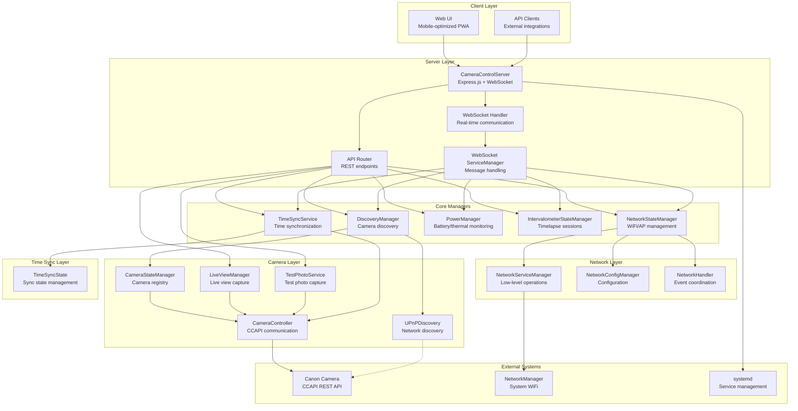

# Pi Camera Control - Architecture Overview

## System Overview

The Pi Camera Control system is a sophisticated Node.js-based camera control application designed for off-grid Canon camera operation. Currently in **Phase 2** of development, it provides a complete backend infrastructure with Express.js server, WebSocket real-time communication, and mobile-optimized web interface.

### Project Phases

- ✅ **Phase 1**: Python PoC (`archive/poc/interval.py`) - Basic intervalometer functionality
- ✅ **Phase 2**: Node.js Backend - Express server with WebSocket, power management, systemd service
- 🔄 **Phase 3**: Web Interface - Mobile-optimized browser UI for camera control
- ⏳ **Phase 4**: Complete MVP - Raspberry Pi access point with full field deployment

## High-Level System Architecture



## Technology Stack

### Backend (Phase 2)
- **Runtime**: Node.js ≥20.0.0
- **Framework**: Express.js with middleware (helmet, cors, compression)
- **WebSocket**: ws library for real-time communication
- **HTTP Client**: axios for Canon CCAPI communication
- **Logging**: winston for structured logging
- **Process Management**: systemd service for automatic startup/restart

### Core Dependencies
```json
{
  "axios": "^1.5.0",
  "express": "^4.18.2",
  "ws": "^8.14.0",
  "winston": "^3.10.0",
  "node-cron": "^3.0.2",
  "xml2js": "^0.6.2"
}
```

### Frontend (Phase 3)
- **UI**: Mobile-optimized Progressive Web App (PWA)
- **Architecture**: Static HTML/CSS/JS served by Express
- **Communication**: WebSocket for real-time updates
- **Deployment**: Served from `public/` directory

## Core Components

### 1. CameraControlServer (`src/server.js`)
Main application server that orchestrates all components:
- Express.js HTTP server with WebSocket upgrade capability
- Middleware configuration (security, compression, CORS)
- Route setup and static file serving
- Graceful shutdown handling
- Event coordination between managers

### 2. Discovery System
**DiscoveryManager** (`src/discovery/manager.js`)
- UPnP-based automatic camera discovery
- Manual IP connection fallback
- Camera registry management
- Primary camera selection
- Camera IP change detection and reconnection

**UPnPDiscovery** (`src/discovery/upnp.js`)
- Network interface discovery
- UPnP SSDP protocol implementation
- Device lifecycle management
- Multicast group management

### 3. Camera Management
**CameraStateManager** (`src/camera/state-manager.js`)
- Centralized camera registry
- Connection state tracking
- Primary camera management
- Camera IP change handling

**CameraController** (`src/camera/controller.js`)
- Canon CCAPI v100+ communication
- Automatic endpoint discovery
- Connection monitoring and health checks
- Photo capture with error recovery
- Camera settings retrieval

**LiveViewManager** (`src/camera/liveview-manager.js`)
- Live view image capture from camera
- Image storage and management
- Real-time preview generation

**TestPhotoService** (`src/camera/test-photo.js`)
- Test photo capture with quality override
- EXIF metadata extraction
- Timestamped photo naming and storage
- Integration with CCAPI event polling
- In-memory photo management
- Concurrent capture prevention

### 4. Network Management
**NetworkStateManager** (`src/network/state-manager.js`)
- High-level network state management
- Access point configuration
- Interface state monitoring
- WiFi country code management
- Network transition handling

**NetworkServiceManager** (`src/network/service-manager.js`)
- Low-level NetworkManager operations via nmcli
- WiFi scanning and connection
- Service management (hostapd, dnsmasq)
- Connection verification with retry logic
- Saved network management

**NetworkConfigManager** (`src/network/config-manager.js`)
- Network configuration persistence
- Access point settings management
- Interface configuration

**NetworkHandler** (`src/network/handler.js`)
- Network event coordination
- WebSocket message handling for network operations
- Connection result broadcasting

### 5. Power and Monitoring
**PowerManager** (`src/system/power.js`)
- Raspberry Pi specific monitoring
- Battery/UPS detection
- Thermal monitoring
- Power optimization recommendations
- System uptime tracking

### 6. Intervalometer System
**IntervalometerStateManager** (`src/intervalometer/state-manager.js`)
- Centralized session management
- Report persistence and retrieval
- User decision workflows
- Unsaved session recovery
- Cross-reboot session handling

**TimelapseSession** (`src/intervalometer/timelapse-session.js`)
- Session execution engine
- Event-driven state machine
- Error handling and recovery
- Session statistics tracking

### 7. Time Synchronization System
**TimeSyncService** (`src/timesync/service.js`)
- Client time synchronization protocol
- GPS integration support
- Camera time synchronization
- Manual time setting
- Activity logging

**TimeSyncState** (`src/timesync/state.js`)
- Time sync state management
- Synchronization status tracking
- Reliability monitoring
- Activity log management

### 8. WebSocket Management
**WebSocketHandler** (`src/websocket/handler.js`)
- Client connection management
- Message routing and dispatch
- Event broadcasting
- Connection health monitoring

**WebSocketServiceManager** (`src/websocket/service-manager.js`)
- Service-specific WebSocket operations
- Message type handling
- Response coordination

## Deployment Architecture

### Target Hardware
- **Primary**: Raspberry Pi Zero 2W (control device)
- **Camera**: Canon EOS R50 via CCAPI
- **Network**: Dual WiFi capability (client + access point)

### Service Configuration
```bash
# Systemd service
/etc/systemd/system/pi-camera-control.service

# Key features:
- Automatic startup on boot
- Crash recovery with 10-second delay
- Root privileges for network management
- Working directory: /opt/pi-camera-control
```

### Network Configuration
- **Access Point**: `192.168.4.x` network for direct camera connection
- **WiFi Client**: Connects to external networks for internet access
- **Dual Interface**: Simultaneous AP and client operation via NetworkManager

## Event-Driven Architecture

The system uses EventEmitter patterns throughout for loose coupling:

### Event Flow
1. **System Events** → State Managers → WebSocket Broadcasts
2. **User Actions** → API/WebSocket → State Changes → Event Propagation
3. **Hardware Events** → Monitoring → State Updates → Client Notifications

### Key Event Types
- **Discovery Events**: Camera found/lost, connection changes
- **Network Events**: WiFi state changes, AP configuration
- **Power Events**: Battery status, thermal warnings
- **Session Events**: Intervalometer start/stop/completion

## Configuration Management

### Environment Variables
```bash
PORT=3000                    # Server port
CAMERA_IP=192.168.12.98     # Fallback camera IP
CAMERA_PORT=443             # Canon CCAPI port
NODE_ENV=production         # Environment mode
```

### File Structure
```
src/
├── server.js                    # Main server entry point
├── routes/api.js                # REST API routes
├── websocket/
│   ├── handler.js               # WebSocket communication
│   └── service-manager.js       # Service-specific handlers
├── discovery/
│   ├── manager.js               # Discovery orchestration
│   └── upnp.js                  # UPnP SSDP implementation
├── camera/
│   ├── controller.js            # CCAPI communication
│   └── state-manager.js         # Camera registry
├── network/
│   ├── state-manager.js         # High-level network state
│   ├── service-manager.js       # NetworkManager operations
│   ├── config-manager.js        # Configuration management
│   └── handler.js               # Event coordination
├── system/
│   └── power.js                 # Power/thermal monitoring
├── intervalometer/
│   ├── state-manager.js         # Session management
│   └── timelapse-session.js     # Session execution
├── timesync/
│   ├── service.js               # Time sync protocol
│   └── state.js                 # Sync state management
└── utils/                       # Shared utilities

public/                          # Web interface
runtime/                         # Service files
setup/                          # Installation scripts
data/timelapse-reports/         # Persistent session data
```

## Security Considerations

### Network Security
- HTTPS for Canon CCAPI (self-signed certificates accepted)
- CORS configured for cross-origin requests
- Helmet.js for security headers

### Access Control
- Local network access only (no internet exposure)
- systemd service isolation
- Root privileges only for network operations

### SSL/TLS
- Canon cameras use self-signed certificates
- `NODE_TLS_REJECT_UNAUTHORIZED='0'` for camera communication
- Production deployment should use proper certificates for web interface

## Performance Optimizations

### Memory Management
- JSON payload limits (10MB) for Pi optimization
- Periodic cleanup of dead WebSocket connections
- Efficient event listener management

### Network Efficiency
- Connection pooling for camera communication
- Compressed responses via compression middleware
- Optimized polling intervals (10s monitoring, 30s status)

### Battery Optimization
- Configurable monitoring intervals
- Thermal throttling detection
- Power state caching

## Monitoring and Logging

### Logging Strategy
- **winston** structured logging
- Log levels: error, warn, info, debug
- Timestamp and context information
- File and console output

### Health Monitoring
- `/health` endpoint for system status
- WebSocket connection monitoring
- Camera connection health checks
- System resource monitoring

### Metrics
- Connection uptime tracking
- Photo success/failure rates
- Network state transitions
- Power consumption trends

## Known Issues and Technical Debt

### Error Response Patterns
**Issue**: The system currently uses three different error response patterns:
1. WebSocket error messages: `{ type: 'error', data: { message: 'Error' } }`
2. Operation result errors: `{ type: 'operation_result', success: false, error: 'Error message' }`
3. Event-based errors: `{ type: 'event', eventType: 'operation_failed', data: { error: 'Error' } }`

**Impact**: Inconsistent error handling in frontend code, requiring multiple error checking patterns.

### WebSocket Message Schema ✅ **RESOLVED**
**Status**: Comprehensive schema validation system implemented.
- All message types documented with formal schemas (`test/schemas/`)
- API specification compliance tests enforce correct behavior
- Schema validation prevents field name inconsistencies
- TDD process ensures specifications are followed

**Resolution**: Test-driven approach with specification compliance testing ensures API and WebSocket message consistency.

### Time Synchronization Documentation
**Issue**: The entire time synchronization subsystem was added without updating design documentation.
- Missing design document for timesync architecture
- WebSocket protocol for time sync not documented
- Camera sync workflow not specified

**Impact**: Difficult to maintain or extend time sync features without understanding the design.

### Session Management Complexity
**Issue**: Session save/discard workflow has multiple state transitions not fully documented.
- User decision flow for unsaved sessions
- Cross-reboot session recovery logic
- Report management lifecycle

**Impact**: Complex state management that's difficult to debug or modify.

### Network Transition Handling
**Issue**: Camera IP change detection and reconnection logic is undocumented.
- Automatic reconnection on network changes
- Primary camera failover behavior
- Connection verification timing

**Impact**: Network-related bugs are difficult to diagnose without understanding the transition logic.

### Component Coupling
**Issue**: Some components have evolved to have tighter coupling than originally designed.
- WebSocketServiceManager directly accesses multiple state managers
- Network events trigger cascading updates across components
- Time sync touches camera controller directly

**Impact**: Changes in one component can have unexpected effects on others.

### API Endpoint Proliferation
**Issue**: API endpoints have grown organically without consistent naming or structure.
- 60+ endpoints vs 47 originally documented
- Inconsistent URL patterns and parameter naming
- Some endpoints duplicate WebSocket functionality

**Impact**: API is becoming difficult to maintain and document comprehensively.

## Migration and Improvement Notes

### Planned Improvements
1. **Standardize error responses**: Define single error format for all responses
2. **Create WebSocket schemas**: Formal message type definitions with validation
3. **Document time sync system**: Complete design document for time synchronization
4. **Refactor session management**: Simplify state machine and document transitions
5. **API consolidation**: Review and consolidate redundant endpoints

### Development Guidelines
1. **Always check existing patterns**: Review similar features before implementing new ones
2. **Update documentation first**: Design changes before implementation
3. **Maintain backward compatibility**: Don't break existing frontend when modifying messages
4. **Test network transitions**: Verify camera reconnection on network changes
5. **Validate message contracts**: Ensure frontend/backend field names match exactly