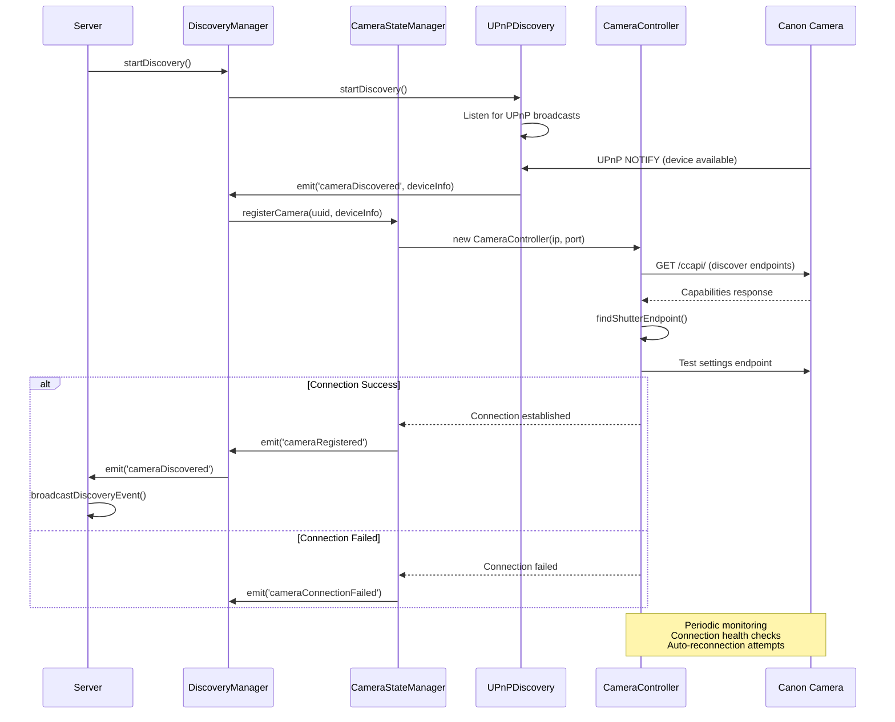
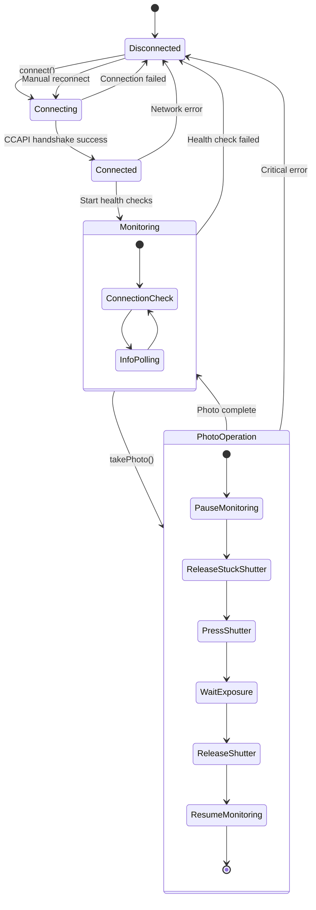

# Camera Management System

## Overview

The camera management system provides comprehensive Canon camera discovery, connection management, and CCAPI communication. It's built around a multi-layered architecture with automatic discovery, robust connection handling, and health monitoring.

## Architecture Components

### 1. DiscoveryManager (`src/discovery/manager.js`)
Central orchestrator for camera discovery and high-level camera management:
- Coordinates UPnP discovery and manual connections
- Delegates camera state management to CameraStateManager
- Provides unified API for camera operations
- Manages primary camera selection

### 2. CameraStateManager (`src/camera/state-manager.js`)
Centralized registry and state management for all discovered cameras:
- Maintains camera registry with connection states
- Manages primary camera designation
- Handles connection lifecycle events
- Provides connection history tracking

### 3. CameraController (`src/camera/controller.js`)
Low-level Canon CCAPI communication and connection management:
- Direct CCAPI REST API communication
- Connection health monitoring
- Photo capture operations
- Error recovery and reconnection

### 4. UPnPDiscovery (`src/discovery/upnp.js`)
Network-based automatic camera discovery:
- UPnP SSDP protocol implementation
- Network interface management
- Device lifecycle tracking

## Camera Discovery and Connection Flow



## Camera Controller State Machine



## Canon CCAPI Integration

### Endpoint Discovery
The system automatically discovers available CCAPI endpoints:

```javascript
// From src/camera/controller.js:86-94
const response = await this.client.get(`${this.baseUrl}/ccapi/`);
this._capabilities = response.data;
this.shutterEndpoint = this.findShutterEndpoint(this.capabilities);
```

### Supported Operations

#### Photo Capture
```javascript
// Manual focus attempt first, then autofocus fallback
let pressResult = await this.pressShutter(false); // Manual focus
if (!pressResult) {
    pressResult = await this.pressShutter(true); // Autofocus
}
```

#### Settings Retrieval
```javascript
// Camera settings via CCAPI ver100
const response = await this.client.get(`${this.baseUrl}/ccapi/ver100/shooting/settings`);
```

#### Battery Status
```javascript
// Try detailed battery list first, fallback to basic
const response = await this.client.get(`${this.baseUrl}/ccapi/ver110/devicestatus/batterylist`);
```

### Connection Management

#### Health Monitoring
- **Connection Checks**: Every 10 seconds via `/ccapi/` endpoint
- **Info Polling**: Every 30 seconds for camera settings
- **Failure Tolerance**: 3 consecutive failures before disconnection

```javascript
// From src/camera/controller.js:332-353
this.monitoringInterval = setInterval(async () => {
    if (!this.connected || this.monitoringPaused) return;

    try {
        await this.client.get(`${this.baseUrl}/ccapi/`, { timeout: 8000 });
        this.consecutiveFailures = 0;
    } catch (error) {
        this.consecutiveFailures++;
        if (this.consecutiveFailures >= this.maxConsecutiveFailures) {
            this.handleDisconnection(error);
        }
    }
}, 10000);
```

## Discovery Methods

### 1. UPnP Discovery (Primary)
- **Protocol**: UPnP SSDP (Simple Service Discovery Protocol)
- **Target**: Canon devices with CCAPI capability
- **Network Scope**: Local network broadcasts
- **Automatic**: Continuous discovery with device lifecycle tracking

```javascript
// From src/discovery/upnp.js
// Listens for UPnP NOTIFY messages from Canon cameras
socket.on('message', (msg, rinfo) => {
    const notification = this.parseNotification(msg.toString());
    if (this.isCanonDevice(notification)) {
        this.handleDeviceDiscovered(notification, rinfo);
    }
});
```

### 2. IP Scanning (Fallback)
- **Method**: Systematic IP range scanning
- **Ranges**: Common camera networks (192.168.4.x, 192.168.12.x, etc.)
- **Verification**: CCAPI endpoint test for each IP
- **Use Case**: UPnP failure or manual discovery

```javascript
// From src/discovery/manager.js:242-279
const networkRanges = [
    '192.168.4',   // Access point network
    '192.168.12',  // Development network
    '192.168.1',   // Common home network
    '192.168.0'    // Another common range
];
```

### 3. Manual Connection
- **API**: Direct IP/port specification
- **Use Case**: Known camera IP addresses
- **Validation**: Immediate CCAPI verification
- **Persistence**: Connection history tracking

## Camera State Management

### Registry Structure
```javascript
// CameraStateManager maintains a registry of discovered cameras
cameras: {
    'uuid-1': {
        uuid: 'camera-uuid',
        info: {
            modelName: 'Canon EOS R50',
            ipAddress: '192.168.4.2',
            ccapiUrl: 'https://192.168.4.2:443/ccapi',
            discoveredAt: '2024-01-01T12:00:00Z'
        },
        controller: CameraController,
        isPrimary: true,
        lastSeen: '2024-01-01T12:05:00Z'
    }
}
```

### Primary Camera Selection
- **Automatic**: First successfully connected camera becomes primary
- **Manual**: API endpoint to set specific camera as primary
- **Failover**: Automatic primary reassignment on disconnection

### Connection History
```javascript
// From src/camera/connection-history.js
connectionHistory: [
    {
        ip: '192.168.4.2',
        port: '443',
        timestamp: '2024-01-01T12:00:00Z',
        success: true,
        method: 'upnp'
    }
]
```

## Error Handling and Recovery

### Connection Errors
1. **Network Unreachable**: Retry with exponential backoff
2. **Authentication Failure**: Log error, mark as failed
3. **Timeout**: Increase timeout, retry limited times
4. **SSL Certificate**: Accept self-signed certificates

### Photo Operation Errors
1. **Stuck Shutter**: Force release before operation
2. **Camera Busy**: Wait and retry with longer timeout
3. **Settings Error**: Continue with warning, skip validation
4. **Critical Failure**: Mark camera as disconnected

### Recovery Strategies
- **Health Check Monitoring**: Continuous connection verification
- **Automatic Reconnection**: Background reconnection attempts
- **Graceful Degradation**: Operation continuation with reduced functionality
- **User Notification**: WebSocket events for connection state changes

## Performance Optimizations

### Connection Pooling
- **Axios Instances**: Dedicated HTTP client per camera
- **Keep-Alive**: Persistent connections where possible
- **Timeout Management**: Configurable timeouts per operation type

### Monitoring Efficiency
- **Pausable Monitoring**: Suspend during active operations
- **Adaptive Intervals**: Longer intervals during stable periods
- **Failure Tolerance**: Multiple failures before disconnection

### Memory Management
- **Event Listener Cleanup**: Proper cleanup on disconnection
- **Timer Management**: Clear intervals on shutdown
- **Reference Cleanup**: Remove dead camera references

## API Integration Points

### REST Endpoints
- `GET /api/camera/status` - Current camera connection status
- `POST /api/camera/photo` - Trigger single photo capture
- `POST /api/camera/reconnect` - Manual reconnection trigger
- `POST /api/camera/configure` - Update camera IP configuration
- `GET /api/discovery/cameras` - List all discovered cameras
- `POST /api/discovery/primary/:uuid` - Set primary camera

### WebSocket Events
- `cameraDiscovered` - New camera found
- `cameraConnected` - Camera successfully connected
- `cameraOffline` - Camera disconnected
- `primaryCameraChanged` - Primary camera updated
- `photo_taken` - Photo capture successful

### Event Emitters
```javascript
// DiscoveryManager events
discoveryManager.on('cameraDiscovered', (deviceInfo) => { ... });
discoveryManager.on('cameraConnected', ({ uuid, info, controller }) => { ... });
discoveryManager.on('cameraOffline', (uuid) => { ... });
discoveryManager.on('primaryCameraChanged', (primaryCamera) => { ... });
```

## Configuration

### Camera Settings
```javascript
// Default configuration
const CAMERA_IP = process.env.CAMERA_IP || '192.168.12.98';
const CAMERA_PORT = process.env.CAMERA_PORT || '443';
```

### Connection Parameters
- **Timeout**: 10 seconds for standard operations, 30 seconds for photos
- **Retry Attempts**: 3 consecutive failures before disconnection
- **Monitoring Intervals**: 10s connection check, 30s info polling
- **SSL Verification**: Disabled for Canon self-signed certificates

### Network Configuration
- **UPnP Port**: 1900 (standard SSDP port)
- **Canon Port**: 443 (HTTPS for CCAPI)
- **Interface Binding**: All available network interfaces
- **Multicast**: 239.255.255.250 for UPnP discovery