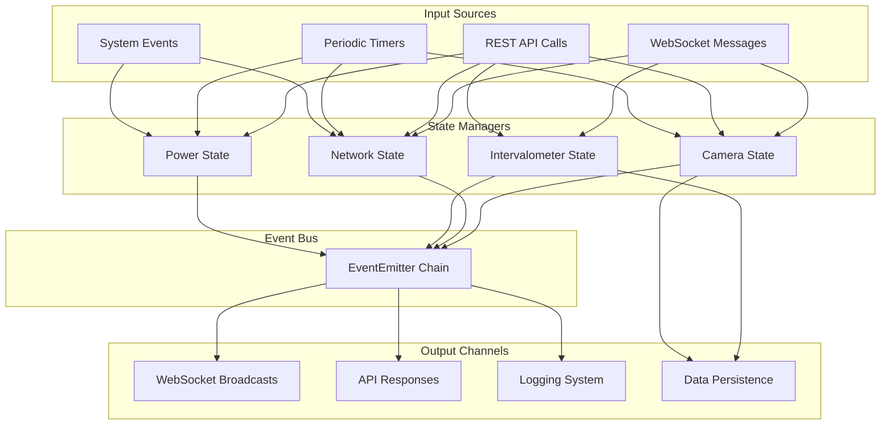

# Data Flow and Event Architecture

## Overview

The Pi Camera Control system is built on a comprehensive event-driven architecture that enables loose coupling between components, real-time status updates, and responsive user interactions. The system uses Node.js EventEmitter patterns throughout to coordinate between managers, handle state changes, and provide real-time communication.

## Event-Driven Architecture Patterns

### Core Event Flow
The system follows a consistent event flow pattern:
1. **Input Sources** → **State Managers** → **Event Bus** → **Output Channels**
2. User actions trigger state changes which emit events
3. Events are captured and broadcast to interested components
4. Real-time updates are pushed to clients via WebSocket

## Data Flow Between Core Components



## EventEmitter Hierarchy

### Primary Event Emitters

#### 1. CameraControlServer (`src/server.js`)
**Role**: Central event coordinator and broadcaster
- Receives events from all managers
- Coordinates WebSocket broadcasting
- Handles server lifecycle events

```javascript
// Event forwarding from managers to WebSocket clients
this.discoveryManager.on('cameraDiscovered', (deviceInfo) => {
    this.broadcastDiscoveryEvent('cameraDiscovered', deviceInfo);
});

this.intervalometerStateManager.on('sessionStarted', (data) => {
    this.broadcastTimelapseEvent('session_started', data);
});
```

#### 2. DiscoveryManager (`src/discovery/manager.js`)
**Events Emitted:**
- `cameraDiscovered` - New camera found via UPnP or scanning
- `cameraConnected` - Camera successfully connected
- `cameraOffline` - Camera disconnected or unreachable
- `primaryCameraChanged` - Primary camera designation changed
- `primaryCameraDisconnected` - Primary camera lost

```javascript
// Event binding from UPnP and state manager
this.upnp.on('cameraDiscovered', (deviceInfo) => {
    this.handleCameraDiscovered(deviceInfo);
});

this.cameraStateManager.on('primaryCameraChanged', (data) => {
    this.emit('primaryCameraChanged', data);
});
```

#### 3. NetworkStateManager (`src/network/state-manager.js`)
**Events Emitted:**
- `serviceStateChanged` - Network service status change
- `interfaceStateChanged` - Network interface status change
- `accessPointConfigured` - AP configuration updated
- `wifiConnectionStarted` - WiFi connection attempt
- `wifiConnectionFailed` - WiFi connection failed

```javascript
// Service manager event forwarding
this.serviceManager.on('serviceStateChanged', (data) => {
    this.updateServiceState(data.service, data.state);
    this.emit('serviceStateChanged', data);
});
```

#### 4. IntervalometerStateManager (`src/intervalometer/state-manager.js`)
**Events Emitted:**
- `sessionStarted` - Timelapse session began
- `sessionCompleted` - Session finished successfully
- `sessionStopped` - Session manually stopped
- `sessionError` - Session encountered error
- `reportSaved` - Report saved to persistence
- `reportDeleted` - Report deleted
- `unsavedSessionFound` - Unsaved session detected

#### 5. PowerManager (`src/system/power.js`)
**Events Emitted:**
- `powerStatusChanged` - Battery or thermal status change
- `thermalWarning` - High temperature detected
- `batteryLow` - Low battery warning

## Event Broadcasting System

### WebSocket Event Broadcasting

The WebSocket handler provides multiple broadcasting functions for different event types:

#### General Event Broadcasting
```javascript
// From src/websocket/handler.js:853-874
const broadcastEvent = (type, data) => {
    const event = {
        type: 'event',
        eventType: type,
        data,
        timestamp: new Date().toISOString()
    };

    for (const client of clients) {
        if (client.readyState === client.OPEN) {
            client.send(JSON.stringify(event));
        }
    }
};
```

#### Discovery Event Broadcasting
```javascript
// From src/websocket/handler.js:894-916
const broadcastDiscoveryEvent = (eventType, data) => {
    const discoveryEvent = {
        type: 'discovery_event',
        eventType,
        data,
        timestamp: new Date().toISOString()
    };
    // Broadcast to all connected clients
};
```

#### Network Event Broadcasting
```javascript
// From src/websocket/handler.js:30-59
const broadcastNetworkEvent = (eventType, data) => {
    const message = JSON.stringify({
        type: eventType,
        timestamp: new Date().toISOString(),
        data: data
    });
    // Send to all active clients with cleanup
};
```

### Periodic Status Broadcasting

#### Status Update Timer
```javascript
// Every 10 seconds, broadcast complete system status
const statusInterval = setInterval(() => {
    broadcastStatus();
}, 10000);
```

#### Status Composition
```javascript
// From src/websocket/handler.js:106-116
const status = {
    type: 'status_update',
    timestamp: new Date().toISOString(),
    camera: cameraStatus,
    discovery: discoveryStatus,
    power: powerManager.getStatus(),
    network: networkStatus
};
```

## Data Flow Patterns

### 1. Command Flow (User → System)
```
WebSocket/API Request → Router → Manager → State Change → Event Emission → Response
```

**Example: Take Photo**
```javascript
// WebSocket message → handler → camera controller → photo operation → event
handleTakePhoto() → cameraController.takePhoto() → emit('photo_taken')
```

### 2. Status Flow (System → User)
```
Periodic Timer → State Collection → Event Broadcasting → WebSocket Clients
```

**Example: Status Update**
```javascript
// Timer → gather states → broadcast → all clients
setInterval() → broadcastStatus() → client.send(status)
```

### 3. Event Flow (System → System)
```
State Change → Event Emission → Event Listener → Action/Broadcast
```

**Example: Camera Discovery**
```javascript
// UPnP discovery → event → registration → broadcast
UPnP.emit('discovered') → DiscoveryManager.on() → broadcast('cameraDiscovered')
```

## State Management Patterns

### Centralized State Managers

Each major subsystem has a dedicated state manager:

#### CameraStateManager
- **Registry**: Map of UUID → Camera objects
- **Primary Camera**: Active camera designation
- **Connection History**: Persistence of successful connections

```javascript
// From src/camera/state-manager.js
cameras: new Map(), // uuid → camera object
primaryCameraUuid: null,
connectionHistory: []
```

#### NetworkStateManager
- **Interface States**: wlan0, ap0 status and configuration
- **Service States**: hostapd, dnsmasq, wpa_supplicant status
- **Configuration Cache**: Current network settings

```javascript
// From src/network/state-manager.js:20-24
networkState: {
    interfaces: new Map(), // ap0, wlan0 states
    services: new Map(),   // hostapd, dnsmasq, wpa_supplicant states
    lastUpdate: null
}
```

#### IntervalometerStateManager
- **Active Sessions**: Current timelapse sessions
- **Session History**: Completed session reports
- **Unsaved Sessions**: Sessions awaiting user decision

### State Synchronization

#### Periodic Updates
- **Camera Health**: Every 10 seconds
- **Network Status**: Every 10 seconds
- **Power Monitoring**: Every 30 seconds
- **Interface Polling**: Every 10 seconds

#### Event-Driven Updates
- **Immediate**: User actions, system events
- **Batched**: Status collection and broadcasting
- **Filtered**: Only relevant state changes emitted

## Data Persistence Patterns

### Session Persistence
```javascript
// Timelapse sessions saved to filesystem
const sessionData = {
    id: sessionId,
    title: title,
    startTime: session.startTime,
    endTime: session.endTime,
    stats: session.stats,
    metadata: session.metadata
};
await fs.writeFile(reportPath, JSON.stringify(sessionData, null, 2));
```

### Connection History
```javascript
// Camera connection attempts tracked
const historyEntry = {
    ip: ip,
    port: port,
    timestamp: new Date().toISOString(),
    success: connected,
    method: 'upnp' | 'manual' | 'scan'
};
```

### Configuration Persistence
- **Network Profiles**: NetworkManager handles persistence
- **Camera Settings**: Stored in memory, not persisted
- **Access Point Config**: Written to system configuration files

## Real-time Communication Flow

### WebSocket Message Flow
1. **Client Connection**: Welcome message with initial status
2. **Message Handling**: Type-based routing to specific handlers
3. **State Updates**: Periodic broadcasts every 10 seconds
4. **Event Notifications**: Immediate event propagation
5. **Error Handling**: Graceful error responses and logging

### Event Priority Levels
1. **Critical**: Camera errors, system failures
2. **High**: User actions, state changes
3. **Normal**: Status updates, monitoring data
4. **Low**: Debug information, trace data

## Performance Optimizations

### Event Handling Efficiency
- **Event Filtering**: Only emit when state actually changes
- **Batch Processing**: Combine multiple state updates
- **Lazy Evaluation**: Defer expensive operations
- **Connection Cleanup**: Remove dead WebSocket connections

### Memory Management
- **Weak References**: Prevent memory leaks in event listeners
- **Timer Cleanup**: Clear intervals on shutdown
- **Event Unbinding**: Remove listeners on component cleanup
- **State Pruning**: Limit history and cache sizes

### Network Efficiency
- **JSON Compression**: Middleware compression for HTTP responses
- **WebSocket Compression**: Efficient message serialization
- **Selective Broadcasting**: Target specific client types
- **Rate Limiting**: Prevent event flooding

## Error Propagation and Handling

### Error Event Flow
```
Error Occurrence → State Manager → Error Event → Logging + Broadcasting
```

### Error Categories
1. **Connection Errors**: Camera/network connectivity issues
2. **Operation Errors**: Failed operations (photo, network commands)
3. **System Errors**: Hardware, service, or resource issues
4. **User Errors**: Invalid input, unauthorized operations

### Error Recovery Strategies
- **Automatic Retry**: With exponential backoff
- **Graceful Degradation**: Continue with reduced functionality
- **User Notification**: Clear error messages via WebSocket
- **Fallback Operations**: Alternative methods when primary fails

## Event Debugging and Monitoring

### Event Logging
```javascript
// From src/utils/logger.js - structured logging for events
logger.info('Event emitted', {
    eventType: 'cameraDiscovered',
    data: deviceInfo,
    timestamp: new Date().toISOString(),
    component: 'DiscoveryManager'
});
```

### Event Tracing
- **Event Source**: Component that emitted the event
- **Event Path**: Flow through the system
- **Event Recipients**: Components that handled the event
- **Event Timing**: Emission and handling timestamps

### Performance Monitoring
- **Event Frequency**: Monitor for event flooding
- **Handler Performance**: Track event processing time
- **Memory Usage**: Monitor event listener memory footprint
- **WebSocket Performance**: Track broadcast efficiency

## Integration with External Systems

### System Events
- **NetworkManager**: D-Bus events for network changes
- **systemd**: Service state change notifications
- **Linux Kernel**: Network interface state changes

### Hardware Events
- **Camera CCAPI**: HTTP responses and status changes
- **USB Events**: Device connection/disconnection
- **Power Events**: Battery status, thermal warnings

### Process Communication
- **Inter-Process**: File system watches, signal handling
- **Child Processes**: Command execution results and errors
- **Service Management**: systemd service state changes

This event-driven architecture enables the Pi Camera Control system to provide responsive, real-time operation while maintaining loose coupling between components and excellent observability for debugging and monitoring.