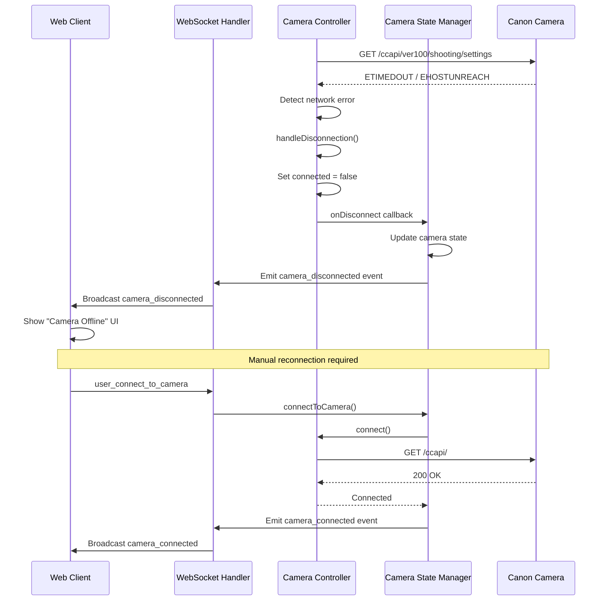
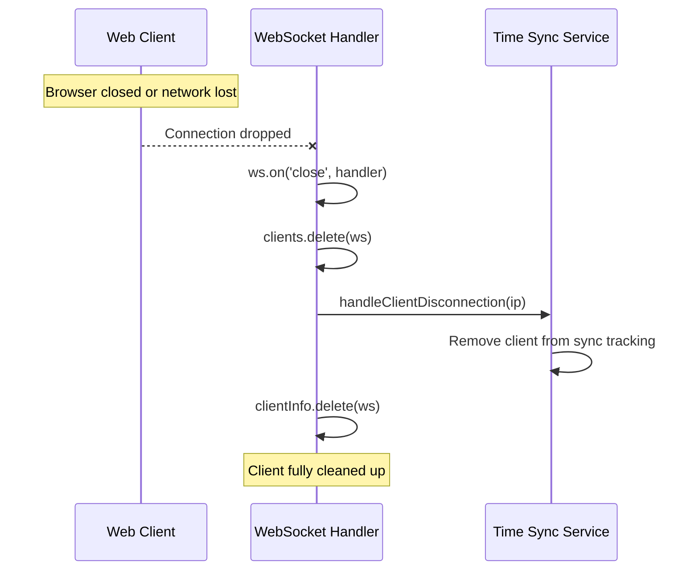
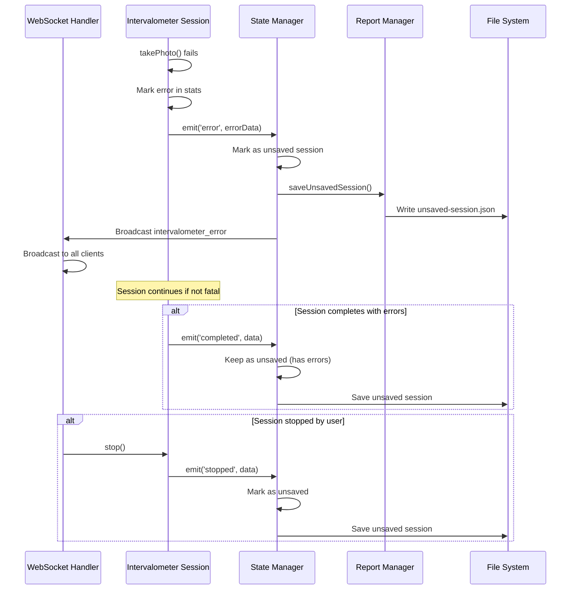
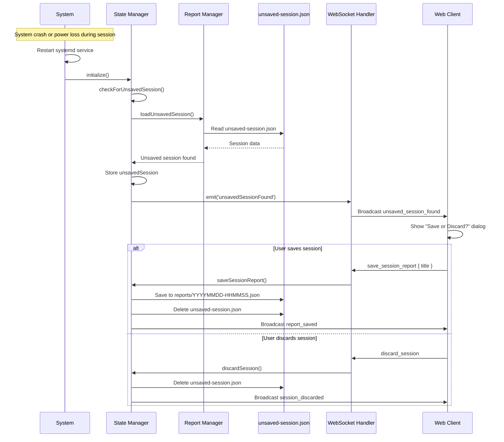
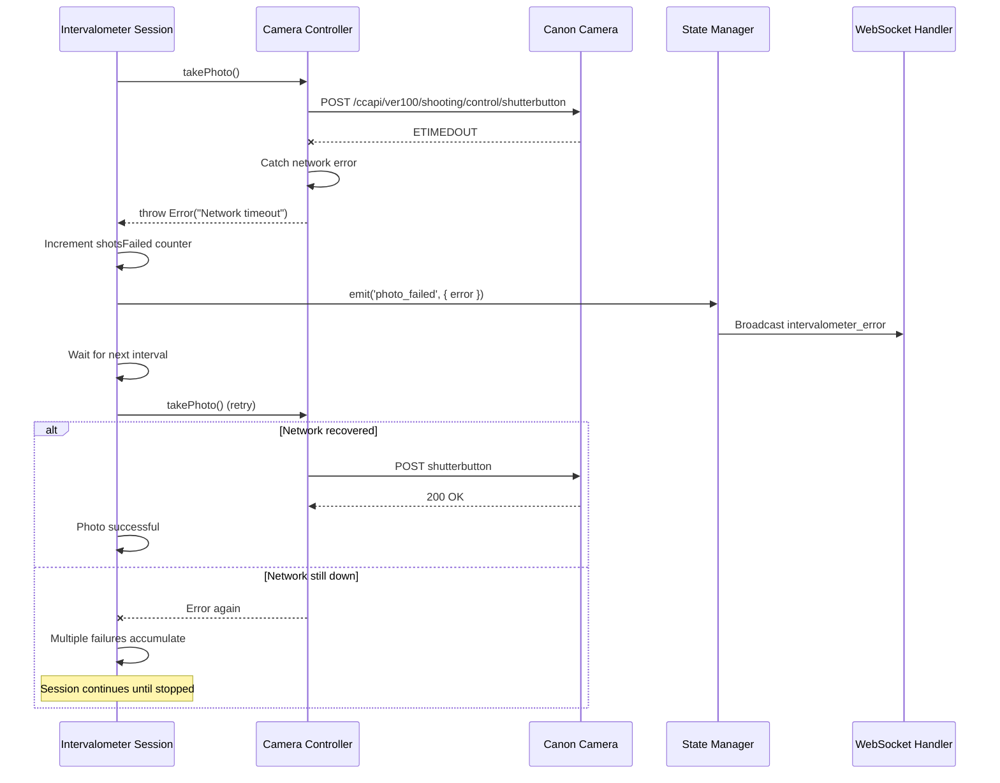
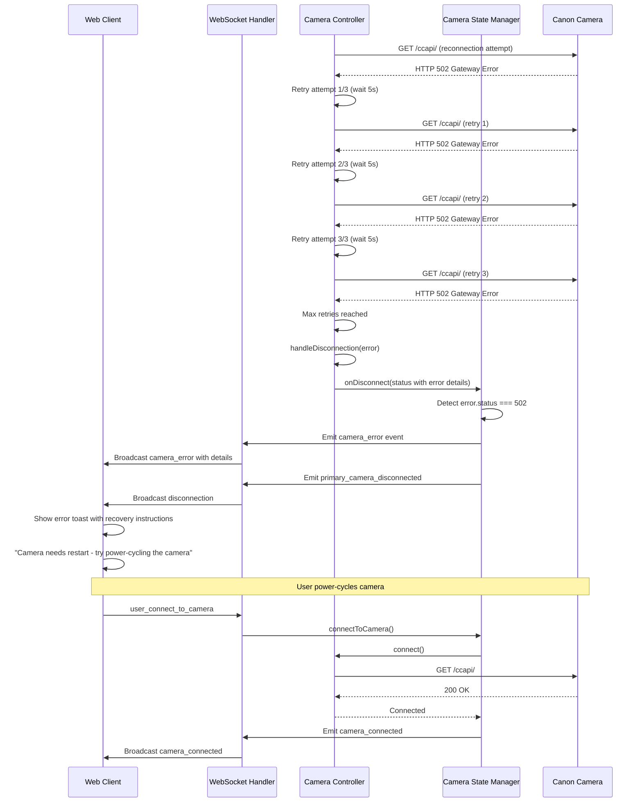

# Error Recovery Sequences

**Version:** 1.0
**Date:** 2025-09-29
**Status:** Complete

## Overview

This document describes the error recovery mechanisms implemented in the pi-camera-control system. Recovery strategies handle camera disconnections, network failures, and session errors gracefully.

---

## 1. Camera Connection Loss Recovery

### Detection

The system detects camera connection loss through network error codes:

**Error Codes Monitored:**

- `EHOSTUNREACH` - Camera network unreachable
- `ECONNREFUSED` - Camera refused connection
- `ETIMEDOUT` - Request to camera timed out

**Detection Points:**

- `getCameraSettings()` - src/camera/controller.js:202-207
- `getDeviceInformation()` - src/camera/controller.js:247-252
- `getCameraBattery()` - src/camera/controller.js:318-327

### Recovery Flow



**Key Implementation Details:**

```javascript
// src/camera/controller.js:596-608
handleDisconnection(error) {
  const wasConnected = this.connected;
  this.connected = false;
  this.lastError = error.message;

  // Notify immediately if we were previously connected
  if (wasConnected && this.onDisconnect) {
    logger.info("Notifying clients of camera disconnection");
    this.onDisconnect(this.getConnectionStatus());
  }

  logger.warn("Camera disconnected, manual reconnection required");
}
```

**No Automatic Reconnection:**

- System does NOT attempt automatic reconnection
- User must manually reconnect via UI
- This prevents repeated failed connection attempts
- Provides user control over camera connection state

---

## 2. WebSocket Client Disconnection

### Cleanup Process

When a WebSocket client disconnects (browser close, network drop, etc.):



**Implementation:**

```javascript
// src/websocket/handler.js:290-302
ws.on("close", (code, reason) => {
  logger.info(
    `WebSocket client disconnected: ${clientId} (${code}: ${reason})`,
  );
  clients.delete(ws);

  // Clean up time sync tracking
  const info = clientInfo.get(ws);
  if (info) {
    timeSyncService.handleClientDisconnection(info.ip);
    clientInfo.delete(ws);
  }
});
```

**Cleanup Steps:**

1. Remove from active clients Set
2. Clean up time sync tracking
3. Remove from clientInfo Map
4. Connection resources released

**No Session Impact:**

- Intervalometer sessions continue running
- Camera remains connected
- Status broadcasts continue (no clients to receive them)
- Client can reconnect anytime and resume monitoring

---

## 3. Intervalometer Session Error Recovery

### Session Error States

Sessions can encounter errors during:

- Photo capture failures
- Camera communication timeouts
- Long exposure interruptions

### Error Flow



**Unsaved Session Data Structure:**

```javascript
// src/intervalometer/state-manager.js:240-249
this.unsavedSession = {
  sessionId: session.id,
  title: session.title,
  completionData: {
    state: session.state,
    stats: session.stats,
    options: session.options,
    timestamp: new Date().toISOString(),
  },
};
```

**Error Recovery Strategy:**

1. **Non-Fatal Errors:** Session continues, errors logged in stats
2. **Fatal Errors:** Session stops, marked as unsaved
3. **Cross-Reboot Recovery:** Unsaved session detected on startup
4. **User Decision:** User must explicitly save with title or discard

---

## 4. Session Interruption Recovery (System Crash/Reboot)

**Note:** While session data IS persisted to disk, **catastrophic failure recovery is not a primary feature** of this hobbyist tool. The persistence mechanism exists to avoid data loss, but:

- No automatic session resume
- Requires user decision (save or discard)
- Not extensively tested for all failure modes
- Emphasis on preventing data loss, not seamless recovery

### Persistence Mechanism

The system provides basic cross-reboot session data persistence:



**File Location:**

```
data/timelapse-reports/unsaved-session.json
```

**When Sessions Are Marked Unsaved:**

1. Session stops (user-initiated stop)
2. Session completes (normal completion)
3. Session encounters error

**Persistence Guarantees:**

- ✅ Session metadata persisted (ID, title, timestamps)
- ✅ Statistics persisted (shots taken, successful, failed)
- ✅ Options persisted (interval, duration, etc.)
- ❌ Individual photo data NOT persisted (photos on camera SD card)
- ❌ In-progress shot NOT persisted (if crash during long exposure)

**Recovery Limitations:**

- If system crashes during photo capture, that photo may be incomplete
- Photo count reflects completed photos only
- Camera SD card has actual photos (may be more than logged count)

**Important:** This is a **data preservation** feature, not a **full recovery system**. For a hobbyist tool, preventing data loss is sufficient. Seamless recovery from crashes/power loss is explicitly out of scope.

---

## 5. Network Failure During Operations

### Photo Capture Network Failure

During intervalometer sessions, network failures to the camera are handled:



**Retry Strategy:**

- No immediate retry within same shot
- Next interval attempt is natural retry
- Failed shots counted in statistics
- Session continues (does not auto-stop on failures)

**Connection Monitoring Pause:**

```javascript
// src/camera/controller.js:584-594
pauseConnectionMonitoring() {
  logger.debug("Pausing camera connection monitoring during photo operation");
  this.monitoringPaused = true;
  // Reset failure counter since we're actively using the camera
  this.consecutiveFailures = 0;
}

resumeConnectionMonitoring() {
  logger.debug("Resuming camera connection monitoring");
  this.monitoringPaused = false;
}
```

**Why Pause Monitoring:**

- Long exposures (30+ seconds) would trigger false disconnection
- Photo operations have their own timeouts (30s for press, 15s for release)
- Prevents duplicate error handling

---

## 6. CCAPI Error Response Handling

### Canon API Error Responses

The system handles documented Canon CCAPI error responses:

**400 Bad Request:**

```json
{
  "message": "Invalid parameter"
}
```

- Indicates malformed request
- Logged with full error details
- Operation fails, error returned to client

**503 Service Unavailable:**

```json
{
  "message": "Device busy"
}
```

**Common 503 Messages:**

- "Device busy" - Camera temporarily unavailable
- "During shooting or recording" - Photo in progress
- "Mode not supported" - Wrong camera mode
- "Out of focus" - AF failed (we use af:false to avoid this)
- "Can not write to card" - SD card error

**Error Logging:**

```javascript
// src/camera/controller.js:361-373
const statusCode = error.response?.status || "unknown";
const apiMessage = error.response?.data?.message || error.message;
const endpoint = this.shutterEndpoint;

logger.error(
  `Shutter press failed - Status: ${statusCode}, API Message: "${apiMessage}", Endpoint: ${endpoint}`,
);

// Log full response data for debugging if available
if (error.response?.data) {
  logger.debug("Full Canon API error response:", error.response.data);
}
```

### HTTP 502 Gateway Error (Non-Standard CCAPI Response)

**What is HTTP 502 in CCAPI Context:**

HTTP 502 Gateway Error is **NOT** a standard CCAPI response defined in Canon's documentation. It indicates that the camera's HTTP service itself is in an error state, typically due to resource exhaustion after intensive operations (e.g., large file downloads).

**Root Cause:**

- Camera HTTP service overwhelmed by connection pool exhaustion
- Camera still busy processing after large file operations (29MB+ RAW+JPEG downloads)
- Camera's HTTPS server in error state, unable to process new requests
- Typically occurs after test photo downloads with high-resolution RAW+JPEG files

**Detection:**

The system detects HTTP 502 errors at multiple points:

```javascript
// src/camera/controller.js:136-175 (connect method)
if (error.response?.status === 502) {
  logger.warn(
    `Camera returned HTTP 502 Gateway Error (attempt ${retryAttempt + 1}/${maxRetries})`,
  );
  logger.warn(
    "This is NOT a standard CCAPI response - camera HTTP service may be in error state",
  );
  // Retry with delay...
}

// src/camera/controller.js:256-269 (getCameraSettings and other methods)
if (
  error.code === "EHOSTUNREACH" ||
  error.code === "ECONNREFUSED" ||
  error.code === "ETIMEDOUT" ||
  error.response?.status === 502
) {
  if (error.response?.status === 502) {
    logger.warn(
      "HTTP 502: Camera HTTP service in error state (not standard CCAPI response)",
    );
  }
  this.handleDisconnection(error);
}
```

**Recovery Strategy:**

1. **Initial Connection (connect method):**
   - Retry up to 3 times with 5-second delays
   - Allow camera time to recover from error state
   - After max retries, fail with user-friendly error message

2. **During Operations (camera methods):**
   - Detect 502 immediately
   - Trigger disconnection handling
   - Emit `camera_error` WebSocket event with detailed information
   - Notify user with recovery instructions

3. **User Notification:**
   - WebSocket event: `camera_error` (and `cameraError` for compatibility)
   - Error payload:

   ```javascript
   {
     uuid: "camera-uuid",
     code: "CAMERA_HTTP_ERROR_502",
     message: "Camera HTTP service returned 502 error",
     details: {
       errorCode: "CAMERA_HTTP_502",
       errorStatus: 502,
       lastError: "original error message"
     },
     severity: "error",
     recoveryAction: "power_cycle_camera",
     userMessage: "Camera needs restart - try power-cycling the camera"
   }
   ```

**Recovery Flow:**



**Prevention Measures:**

1. **Connection Pooling:**
   - Use `keepAlive: true` to reuse TCP connections
   - Limit to 1 concurrent connection (`maxSockets: 1`)
   - Keep 1 connection in pool for reuse (`maxFreeSockets: 1`)
   - Prevents overwhelming camera's limited HTTPS capacity

2. **Connection Monitoring:**
   - Pause connection monitoring during long operations (downloads)
   - Prevents false disconnection during busy periods
   - Resume monitoring after operation completes

**Implementation Details:**

```javascript
// src/camera/controller.js:27-40 (Connection pooling configuration)
this.client = axios.create({
  timeout: 10000,
  httpsAgent: new https.Agent({
    rejectUnauthorized: false,
    keepAlive: true, // Reuse TCP connections
    keepAliveMsecs: 30000,
    maxSockets: 1, // Limit concurrent connections
    maxFreeSockets: 1, // Keep 1 in pool
  }),
});

// src/camera/test-photo.js:234-235 (Pause monitoring during downloads)
controller.pauseConnectionMonitoring();
logger.debug("Paused connection monitoring for photo download");

// src/camera/test-photo.js:395-398 (Resume in finally block)
const controller = this.getController();
if (controller) {
  controller.resumeConnectionMonitoring();
  logger.debug("Resumed connection monitoring after photo operation");
}
```

**User Recovery Instructions:**

When HTTP 502 error occurs:

1. Power-cycle the camera (turn off, wait 5 seconds, turn on)
2. Wait for camera to fully boot (10-15 seconds)
3. Manually reconnect via UI "Connect to Camera" button
4. If problem persists, check camera settings (ensure not in playback mode)

**Known Triggers:**

- Test photo capture with RAW+JPEG at highest quality (29MB+ files)
- Multiple rapid photo downloads without delays
- Connection pool exhaustion from creating new connections per request (fixed)
- Camera busy state after intensive file operations

---

## 7. What Does NOT Exist

**No Stuck Shutter Recovery:**

- There is NO automatic stuck shutter detection
- There is NO stuck shutter release mechanism
- The code comment "Release any stuck shutter first" is misleading
- It simply calls `releaseShutter()` which:
  - For regular endpoint: does nothing (skips)
  - For manual endpoint: sends release action
- This ensures clean state, but is not "recovery"

**No Automatic Camera Reconnection:**

- System does not retry failed connections
- User must manually reconnect via UI
- This is intentional design decision

**No Session Auto-Resume:**

- Unsaved sessions require user decision
- System does not automatically resume interrupted sessions
- User must explicitly choose to save or discard

---

## Summary

### Recovery Mechanisms That Exist

| Error Type                  | Detection                        | Recovery Strategy                           | User Action Required               |
| --------------------------- | -------------------------------- | ------------------------------------------- | ---------------------------------- |
| Camera connection loss      | Network errors (ETIMEDOUT, etc.) | Mark disconnected, notify clients           | Yes - Manual reconnect             |
| WebSocket client disconnect | Socket close/error events        | Clean up resources, continue operation      | No - Client can reconnect anytime  |
| Photo capture failure       | Camera API errors                | Log failure, continue session               | No - Automatic retry next interval |
| Session interruption        | Crash/reboot                     | Persist to disk, detect on startup          | Yes - Save or discard decision     |
| Network during operation    | Timeout during photo             | Count as failed shot, retry next interval   | No - Automatic handling            |
| Canon API errors            | 400/503 responses                | Log with details, fail operation gracefully | Depends on error type              |

### Recovery Mechanisms That Don't Exist

- ❌ Automatic camera reconnection
- ❌ Stuck shutter detection/recovery
- ❌ Automatic session resume after crash
- ❌ Immediate retry on photo failure
- ❌ Connection pooling or failover

### Design Philosophy

The system follows a **"fail gracefully, recover manually"** philosophy:

- Errors are logged comprehensively
- State is preserved when possible
- Users are notified clearly
- Critical operations (sessions) persist across crashes
- User retains control over recovery actions

This approach prioritizes:

1. **Data integrity** - Don't lose session data
2. **User awareness** - Clear error messaging
3. **System stability** - No retry loops or automatic reconnection storms
4. **Operational continuity** - Sessions continue despite transient failures

---

**Last Updated:** 2025-09-29
**Implementation Files:**

- `src/camera/controller.js` - Camera connection error handling
- `src/websocket/handler.js` - WebSocket lifecycle and cleanup
- `src/intervalometer/state-manager.js` - Session persistence and recovery
- `src/intervalometer/report-manager.js` - Unsaved session file management
- `src/camera/state-manager.js` - Camera state and disconnection handling
