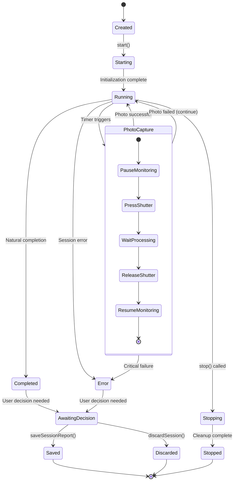
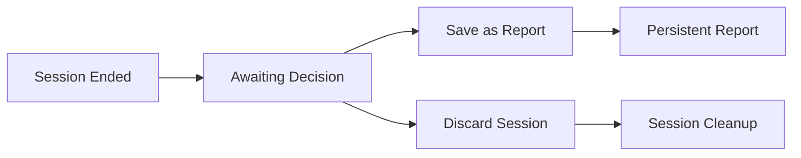

# Intervalometer and Timelapse System

## Overview

The intervalometer system provides sophisticated timelapse photography capabilities with session management, user decision workflows, and comprehensive reporting. Built around an event-driven architecture, it supports both legacy compatibility and modern timelapse session management with persistence and user interaction.

## System Architecture

### Core Components

#### 1. IntervalometerStateManager (`src/intervalometer/state-manager.js`)
**Role**: Centralized session and report management
- Session lifecycle coordination
- Report persistence and retrieval
- User decision workflow management
- Event broadcasting for UI updates

#### 2. TimelapseSession (`src/intervalometer/timelapse-session.js`)
**Role**: Individual session execution engine
- Photo capture scheduling and execution
- State machine for session lifecycle
- Error handling and recovery
- Statistics tracking and reporting

#### 3. IntervalometerSession (`src/intervalometer/session.js`)
**Role**: Legacy compatibility layer
- Maintains existing API contracts
- Delegates to new TimelapseSession
- Ensures zero breaking changes during migration

#### 4. ReportManager (`src/intervalometer/report-manager.js`)
**Role**: Report persistence and management
- JSON file-based storage
- Report CRUD operations
- Session to report conversion
- Data validation and integrity

## Session Lifecycle State Machine



## Session Management

### Session Creation and Configuration

#### Basic Session Options
```javascript
// From TimelapseSession constructor
const defaultOptions = {
    interval: 10,           // Seconds between photos
    totalShots: null,       // Unlimited if null
    stopTime: null,         // Stop at specific time
    title: null,            // Session title (auto-generated if null)
    timeout: 30000          // Photo operation timeout
};
```

#### Enhanced Session Options
```javascript
// Enhanced configuration for advanced usage
const enhancedOptions = {
    ...defaultOptions,
    title: "Night Sky Timelapse",
    metadata: {
        location: "Mt. Wilson Observatory",
        weather: "Clear skies",
        equipment: "Canon EOS R50 + 24-70mm"
    },
    notifications: {
        interval: 10,        // Notify every N photos
        errors: true,        // Notify on errors
        completion: true     // Notify on completion
    }
};
```

### Session State Tracking

#### Session Statistics
```javascript
// From TimelapseSession state management
this.stats = {
    startTime: null,
    endTime: null,
    shotsTaken: 0,
    shotsSuccessful: 0,
    shotsFailed: 0,
    currentShot: 0,
    totalShots: options.totalShots,
    interval: options.interval,
    errors: [],
    lastPhotoTime: null,
    nextPhotoTime: null,
    estimatedEndTime: null
};
```

#### Real-time State Updates
```javascript
// Event emission for UI updates
this.emit('started', {
    sessionId: this.id,
    title: this.title,
    startTime: this.stats.startTime,
    options: this.options
});

this.emit('photo_taken', {
    sessionId: this.id,
    shotNumber: this.stats.currentShot,
    success: true,
    timestamp: new Date().toISOString()
});
```

## Photo Capture Process

### Capture Sequence
1. **Pre-capture**: Pause connection monitoring
2. **Shutter Release**: Ensure no stuck shutter
3. **Focus Attempt**: Manual focus first, autofocus fallback
4. **Exposure**: Wait for camera processing
5. **Post-capture**: Resume monitoring, update statistics

```javascript
// From CameraController photo capture sequence
async takePhoto() {
    try {
        // Pause monitoring during operation
        this.pauseConnectionMonitoring();

        // Release any stuck shutter
        await this.releaseShutter();

        // Try manual focus first, then autofocus
        let pressResult = await this.pressShutter(false);
        if (!pressResult) {
            pressResult = await this.pressShutter(true);
        }

        // Wait for processing
        await new Promise(resolve => setTimeout(resolve, 1000));

        // Release shutter
        await this.releaseShutter();

        return true;
    } finally {
        this.resumeConnectionMonitoring();
    }
}
```

### Error Handling and Recovery

#### Photo Operation Errors
1. **Camera Unavailable**: Session pauses, waits for reconnection
2. **Shutter Stuck**: Automatic release attempt
3. **Timeout**: Extended timeout for long exposures
4. **Critical Failure**: Session error state with user notification

#### Recovery Strategies
```javascript
// From TimelapseSession error handling
async handlePhotoError(error) {
    this.stats.shotsFailed++;
    this.stats.errors.push({
        timestamp: new Date().toISOString(),
        error: error.message,
        shotNumber: this.stats.currentShot
    });

    // Emit error event for logging and UI
    this.emit('photo_failed', {
        sessionId: this.id,
        shotNumber: this.stats.currentShot,
        error: error.message,
        canContinue: this.canContinueAfterError(error)
    });

    // Decide whether to continue or abort
    if (this.shouldAbortSession(error)) {
        await this.abort('Critical photo error');
    }
}
```

## Timing and Scheduling

### Interval Validation
```javascript
// From CameraController validation
async validateInterval(intervalSeconds) {
    const settings = await this.getCameraSettings();
    const shutterSpeed = this.parseShutterSpeed(settings);

    if (intervalSeconds <= shutterSpeed) {
        return {
            valid: false,
            error: `Interval (${intervalSeconds}s) must be longer than shutter speed (${shutterSpeed}s)`
        };
    }

    return { valid: true };
}
```

### Scheduling Engine
```javascript
// From TimelapseSession scheduling
scheduleNextPhoto() {
    const now = Date.now();
    const nextTime = this.stats.lastPhotoTime + (this.options.interval * 1000);
    const delay = Math.max(0, nextTime - now);

    this.nextPhotoTimeout = setTimeout(() => {
        this.executePhotoCapture();
    }, delay);

    this.stats.nextPhotoTime = new Date(nextTime).toISOString();
}
```

### Stop Conditions
1. **Shot Limit**: Reached configured total shots
2. **Time Limit**: Reached specified stop time
3. **Manual Stop**: User-initiated stop
4. **Error Abort**: Critical error forces stop

## User Decision Workflow

### Session Completion States
After a session ends (completed, stopped, or error), it enters an "awaiting decision" state where the user must choose to save or discard the session.



### Decision Workflow Events
```javascript
// From IntervalometerStateManager event handling
session.on('completed', (completionData) => {
    // Mark session as needing user decision
    this.markSessionForDecision(completionData.sessionId);

    // Broadcast to UI
    this.emit('unsavedSessionFound', {
        sessionId: completionData.sessionId,
        title: completionData.title,
        stats: completionData.stats
    });
});
```

### User Actions
```javascript
// Save session as permanent report
async saveSessionReport(sessionId, title) {
    const session = this.getSession(sessionId);
    const report = await this.reportManager.createReport(session, title);

    this.emit('reportSaved', { report });
    this.cleanupSession(sessionId);
    return report;
}

// Discard session without saving
async discardSession(sessionId) {
    this.cleanupSession(sessionId);
    this.emit('sessionDiscarded', { sessionId });
}
```

## Report Management and Persistence

### Report Structure
```javascript
// Report data format
const reportStructure = {
    id: 'report-uuid',
    title: 'Night Sky Timelapse',
    createdAt: '2024-01-01T20:00:00.000Z',
    sessionData: {
        id: 'session-uuid',
        startTime: '2024-01-01T20:00:00.000Z',
        endTime: '2024-01-01T23:30:00.000Z',
        duration: 12600, // seconds
        stats: {
            shotsTaken: 420,
            shotsSuccessful: 418,
            shotsFailed: 2,
            successRate: 99.5
        },
        options: {
            interval: 30,
            totalShots: 420
        },
        errors: [
            {
                timestamp: '2024-01-01T22:15:30.000Z',
                error: 'Camera timeout',
                shotNumber: 150
            }
        ]
    },
    metadata: {
        totalPhotos: 418,
        duration: '3h 30m',
        averageInterval: 30.2,
        location: 'Mt. Wilson Observatory'
    }
};
```

### File-based Persistence
```javascript
// From ReportManager persistence
async saveReport(report) {
    const reportPath = path.join(this.reportsDir, `${report.id}.json`);
    await fs.writeFile(reportPath, JSON.stringify(report, null, 2));

    logger.info('Report saved', {
        reportId: report.id,
        title: report.title,
        path: reportPath
    });
}
```

### Report Operations
- **List Reports**: Get all saved reports with metadata
- **Get Report**: Retrieve specific report by ID
- **Update Title**: Modify report title
- **Delete Report**: Remove report from storage
- **Export Report**: Generate downloadable formats

## Legacy Compatibility

### IntervalometerSession Wrapper
The legacy `IntervalometerSession` class maintains the existing API while delegating to the new `TimelapseSession`:

```javascript
// From IntervalometerSession compatibility layer
export class IntervalometerSession extends EventEmitter {
    constructor(getCameraController, options = {}) {
        super();

        // Create underlying timelapse session
        this.timelapseSession = new TimelapseSession(getCameraController, options);

        // Forward all events for compatibility
        this.bindTimelapseEvents();
    }

    // Delegate methods to underlying session
    async start() {
        return await this.timelapseSession.start();
    }

    getStatus() {
        return this.timelapseSession.getStatus();
    }
}
```

### API Compatibility
- **Legacy Endpoints**: `/api/intervalometer/*` maintained
- **Enhanced Endpoints**: `/api/intervalometer/start-with-title` added
- **Event Names**: Existing event names preserved
- **Response Format**: Backward-compatible response structure

## Event-Driven Integration

### Session Events
```javascript
// TimelapseSession events
session.emit('started', sessionData);
session.emit('photo_taken', photoData);
session.emit('photo_failed', errorData);
session.emit('completed', completionData);
session.emit('stopped', stopData);
session.emit('error', errorData);
```

### State Manager Events
```javascript
// IntervalometerStateManager events
this.emit('sessionStarted', data);
this.emit('sessionCompleted', data);
this.emit('sessionStopped', data);
this.emit('sessionError', data);
this.emit('reportSaved', data);
this.emit('reportDeleted', data);
this.emit('unsavedSessionFound', data);
```

### WebSocket Broadcasting
```javascript
// Real-time event broadcasting to UI
broadcastTimelapseEvent('session_started', sessionData);
broadcastTimelapseEvent('photo_taken', photoData);
broadcastTimelapseEvent('session_completed', completionData);
broadcastTimelapseEvent('session_needs_decision', decisionData);
```

## Performance Optimizations

### Memory Management
- **Session Cleanup**: Automatic cleanup after save/discard
- **Event Unbinding**: Proper cleanup of event listeners
- **Timer Management**: Clear timeouts on session end
- **Photo Data**: Minimal photo metadata storage

### Timing Precision
- **High-Resolution Timers**: Use `process.hrtime()` for precision
- **Drift Compensation**: Adjust scheduling for execution delays
- **Timeout Management**: Configurable timeouts per operation
- **Resource Throttling**: Limit concurrent photo operations

### Storage Efficiency
- **JSON Compression**: Compact report storage
- **Metadata Optimization**: Store only essential data
- **File Organization**: Organized directory structure
- **Cleanup Policies**: Automatic old report management

## Error Scenarios and Recovery

### Common Error Patterns
1. **Camera Disconnection**: Session pauses, resumes on reconnection
2. **Network Issues**: Retry with exponential backoff
3. **Storage Full**: Graceful degradation with warnings
4. **Power Issues**: Session state preservation across restarts

### Recovery Mechanisms
- **Session Resumption**: Resume interrupted sessions
- **State Persistence**: Critical state saved to disk
- **Automatic Retry**: Configurable retry attempts
- **Graceful Degradation**: Continue with reduced functionality

### User Notification
```javascript
// Error notification via WebSocket
broadcastTimelapseEvent('session_error', {
    sessionId: session.id,
    title: session.title,
    error: error.message,
    canRecover: session.canRecover(),
    recommendedAction: session.getRecoveryAction()
});
```

## Configuration and Customization

### Session Configuration
```javascript
// Configurable session parameters
const sessionConfig = {
    // Timing
    interval: 30,                    // Seconds between photos
    totalShots: null,                // Shot limit (null = unlimited)
    stopTime: "06:00",              // Stop time (HH:MM format)

    // Behavior
    continueOnError: true,           // Continue session on photo errors
    maxConsecutiveErrors: 5,         // Abort after N consecutive errors
    photoTimeout: 30000,             // Photo operation timeout (ms)

    // Metadata
    title: "Custom Timelapse",       // Session title
    description: "Long description", // Session description
    tags: ["night", "sky", "stars"]  // Searchable tags
};
```

### System Configuration
- **Storage Location**: Configurable report storage directory
- **Retention Policy**: Automatic cleanup of old reports
- **Notification Settings**: Email/webhook notifications
- **Integration**: External service integrations

This intervalometer system provides a robust foundation for timelapse photography with sophisticated session management, user interaction workflows, and comprehensive error handling while maintaining backward compatibility with existing implementations.