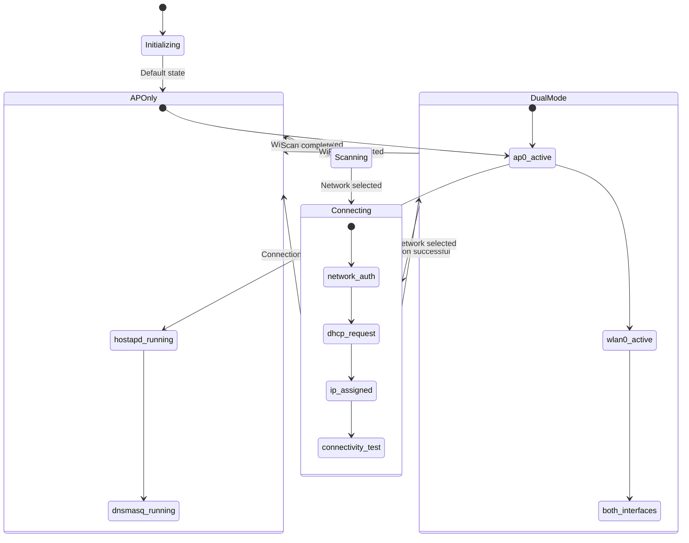
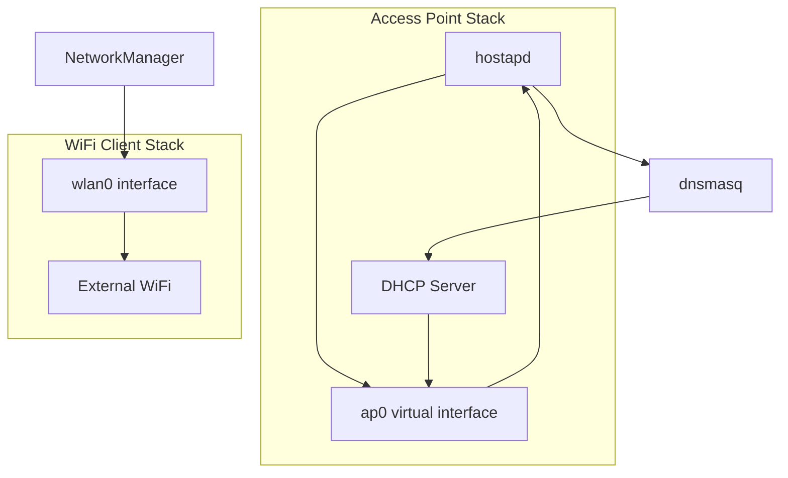

# Network Management System

## Overview

The network management system provides sophisticated dual WiFi interface capability, allowing the Raspberry Pi to simultaneously operate as an access point while connecting to external WiFi networks. Built on NetworkManager integration, it provides seamless WiFi switching, access point configuration, and real-time network state management.

## Architecture Components

### 1. NetworkStateManager (`src/network/state-manager.js`)
High-level network state orchestration:
- Centralized network state management
- Access point lifecycle management
- Interface state monitoring
- Event-driven architecture for state changes

### 2. NetworkServiceManager (`src/network/service-manager.js`)
Low-level NetworkManager operations:
- Direct `nmcli` command execution
- WiFi scanning and connection management
- Service state monitoring (hostapd, dnsmasq)
- Country code and regulatory management

### 3. NetworkConfigManager (`src/network/config-manager.js`)
Configuration file management:
- Access point configuration generation
- DNS and DHCP settings
- Security and encryption setup

## Network State Management Flow



## Dual WiFi Interface Architecture

### Interface Configuration
- **ap0**: Virtual access point interface (192.168.4.x network)
- **wlan0**: Physical WiFi client interface (external network connection)
- **Simultaneous Operation**: Both interfaces active concurrently

### Network Modes

#### 1. Access Point Only (Default)
- **State**: Single interface mode with ap0 active
- **Purpose**: Direct camera and client connections
- **Network**: 192.168.4.1/24 with DHCP range 192.168.4.2-192.168.4.20
- **Services**: hostapd, dnsmasq active

#### 2. Dual Mode (WiFi Client + AP)
- **State**: Both interfaces operational
- **Purpose**: Internet connectivity while maintaining local access
- **Routing**: Separate routing tables for each interface
- **Use Case**: Field operation with internet access

### NetworkManager Integration

The system uses **NetworkManager** instead of wpa_supplicant directly:

```javascript
// From src/network/service-manager.js
// WiFi connection via NetworkManager
const result = await execAsync(`nmcli dev wifi connect "${ssid}" password "${password}"`);

// Network scanning
const { stdout } = await execAsync('nmcli -t -f IN-USE,SSID,MODE,CHAN,RATE,SIGNAL,BARS,SECURITY dev wifi list');
```

### Key Discovery: NetworkManager vs wpa_supplicant
- **Root Cause**: The Pi uses NetworkManager, not wpa_supplicant directly
- **raspi-config Failures**: Normal behavior since raspi-config expects wpa_supplicant management
- **Solution**: All WiFi operations use `nmcli` commands instead of `wpa_cli`

## Network Service Management

### Service Dependencies


### Service States
Each service is monitored for active/inactive status:
- **hostapd**: Access point daemon
- **dnsmasq**: DHCP and DNS server
- **wpa_supplicant@wlan0**: WiFi client authentication (managed by NetworkManager)

### Interface State Monitoring
```javascript
// From src/network/state-manager.js:155-167
async updateInterfaceStates() {
    const interfaces = ['wlan0', 'ap0'];

    for (const iface of interfaces) {
        try {
            const state = await this.serviceManager.getInterfaceState(iface);
            this.updateInterfaceState(iface, state);
        } catch (error) {
            this.updateInterfaceState(iface, { active: false, error: error.message });
        }
    }
}
```

## WiFi Operations

### Network Scanning
```javascript
// WiFi network discovery with signal strength and security info
const networks = await networkServiceManager.scanWiFiNetworks(forceRefresh);

// Result format:
[
    {
        ssid: "NetworkName",
        signal: 75,
        security: "WPA2",
        channel: 6,
        inUse: false
    }
]
```

### Connection Management
```javascript
// Connect to WiFi with automatic profile management
const result = await networkServiceManager.connectToWiFi(ssid, password, priority);

// Connection verification with 5-second delay
setTimeout(async () => {
    const verified = await this.verifyConnection();
    this.broadcastConnectionResult(verified);
}, 5000);
```

### Connection Persistence
- **Automatic**: NetworkManager persists connections across reboots
- **Priority Management**: New connections get higher priority
- **Conflict Resolution**: Removes duplicate SSID profiles before creating new connections

## Access Point Configuration

### Default Configuration
```javascript
// From access point setup
const defaultConfig = {
    ssid: 'Pi-Camera-Control',
    passphrase: 'camera123',
    channel: 7,
    hidden: false,
    interface: 'ap0',
    network: '192.168.4.0/24',
    dhcp_range: '192.168.4.2,192.168.4.20'
};
```

### Configuration Management
```javascript
// From src/network/state-manager.js:273-292
async configureAccessPoint(config) {
    try {
        // Update configuration files
        await this.configManager.updateAccessPointConfig(config);

        // Restart hostapd to apply changes
        await this.serviceManager.restartAccessPoint();

        this.emit('accessPointConfigured', { config });
        return { success: true, config };
    } catch (error) {
        logger.error('Failed to configure access point:', error);
        throw error;
    }
}
```

### Security Settings
- **Encryption**: WPA2-PSK by default
- **Minimum Passphrase**: 8 characters required
- **Channel Selection**: Configurable (default channel 7)
- **Hidden SSID**: Optional stealth mode

## Network State Monitoring

### Real-time Updates
- **Polling Interval**: 10 seconds for interface/service states
- **Event-driven**: Immediate updates on state changes
- **WebSocket Broadcasting**: Real-time client notifications

### State Caching
```javascript
// NetworkStateManager maintains current state
networkState: {
    interfaces: new Map(), // ap0, wlan0 states
    services: new Map(),   // hostapd, dnsmasq, wpa_supplicant states
    lastUpdate: null
}
```

### Force Refresh Capability
```javascript
// API supports force refresh for immediate state updates
const status = await networkManager.getNetworkStatus(forceRefresh = true);
```

## Event-Driven Architecture

### Event Types
- **Interface Events**: State changes for ap0/wlan0
- **Service Events**: hostapd/dnsmasq status changes
- **Connection Events**: WiFi connect/disconnect
- **Configuration Events**: Access point reconfiguration

### Event Broadcasting
```javascript
// WebSocket events for real-time UI updates
this.emit('serviceStateChanged', { service, state });
this.emit('interfaceStateChanged', { interface, state });
this.emit('wifiConnectionStarted', { ssid });
this.emit('wifiConnectionFailed', { ssid, error });
```

## NetworkManager Command Reference

### Essential Commands
```bash
# Check active connections
nmcli -t -f NAME,TYPE,DEVICE con show --active

# Scan for WiFi networks
nmcli -t -f IN-USE,SSID,MODE,CHAN,RATE,SIGNAL,BARS,SECURITY dev wifi list

# Connect to network
nmcli dev wifi connect "SSID" password "password"

# Delete connection profile
nmcli con delete "ConnectionName"

# Force WiFi rescan
nmcli dev wifi rescan

# Interface management
nmcli dev set wlan0 managed yes
nmcli radio wifi on/off
```

### Service Management
```bash
# Access point services
sudo systemctl start hostapd
sudo systemctl start dnsmasq
sudo systemctl status hostapd

# Network interface control
sudo ip link set ap0 up
sudo ip addr show ap0
```

## Error Handling and Recovery

### Connection Failures
1. **Authentication Errors**: Invalid credentials handling
2. **Network Unreachable**: Timeout and retry logic
3. **Interface Issues**: Interface reset and recovery
4. **Service Failures**: Automatic service restart

### Fallback Strategies
- **NetworkManager Fallback**: Direct `ip` commands if nmcli fails
- **Service Recovery**: Automatic service restart on failure
- **Configuration Recovery**: Backup and restore of working configurations
- **Interface Recovery**: Physical interface reset procedures

### Graceful Degradation
- **AP-Only Mode**: Fall back to access point when WiFi fails
- **Partial Functionality**: Continue operation with limited connectivity
- **User Notification**: Clear error messages via WebSocket events

## Performance Optimizations

### Connection Efficiency
- **Profile Reuse**: Leverage NetworkManager connection profiles
- **Parallel Operations**: Simultaneous interface management
- **Optimized Scanning**: Configurable scan intervals
- **Connection Caching**: State persistence across operations

### Resource Management
- **Memory Efficiency**: Cleanup of temporary profiles
- **CPU Optimization**: Efficient polling intervals
- **Network Optimization**: Minimal broadcast traffic

## API Integration

### REST Endpoints
- `GET /api/network/status` - Complete network status
- `GET /api/network/wifi/scan` - Available WiFi networks
- `POST /api/network/wifi/connect` - Connect to WiFi
- `POST /api/network/wifi/disconnect` - Disconnect WiFi
- `GET /api/network/wifi/saved` - Saved network profiles
- `POST /api/network/accesspoint/configure` - Configure AP
- `POST /api/network/wifi/country` - Set regulatory domain

### WebSocket Events
- `network_service_changed` - Service state updates
- `network_interface_changed` - Interface state updates
- `wifi_connection_started` - Connection attempt initiated
- `wifi_connection_failed` - Connection failed
- `access_point_configured` - AP configuration updated

### Network Status Response
```javascript
{
    interfaces: {
        wlan0: {
            active: true,
            connected: true,
            network: "ExternalWiFi",
            signal: 85,
            ip: "192.168.1.100"
        },
        ap0: {
            active: true,
            network: "Pi-Camera-Control",
            ip: "192.168.4.1",
            clients: 2
        }
    },
    services: {
        hostapd: { active: true },
        dnsmasq: { active: true },
        "wpa_supplicant@wlan0": { active: true }
    },
    lastUpdate: "2024-01-01T12:00:00Z"
}
```

## Troubleshooting

### Common Issues
1. **raspi-config WiFi Issues**: Normal - system uses NetworkManager
2. **Connection Verification**: Check for `WiFi connection verified successfully` logs
3. **Signal Strength**: UI displays percentage, stored as dBm in NetworkManager
4. **Network Priorities**: New connections automatically get higher priority

### Debugging Commands
```bash
# Network state inspection
nmcli device status
nmcli connection show
sudo systemctl status hostapd dnsmasq

# Interface debugging
ip addr show
iwconfig
sudo journalctl -u hostapd -f

# NetworkManager debugging
nmcli general status
nmcli radio wifi
```

### Log Analysis
- **Connection Success**: Look for connection verification messages
- **Service Issues**: Monitor systemd service logs
- **Interface Problems**: Check kernel network interface logs
- **Configuration Errors**: Validate config file syntax