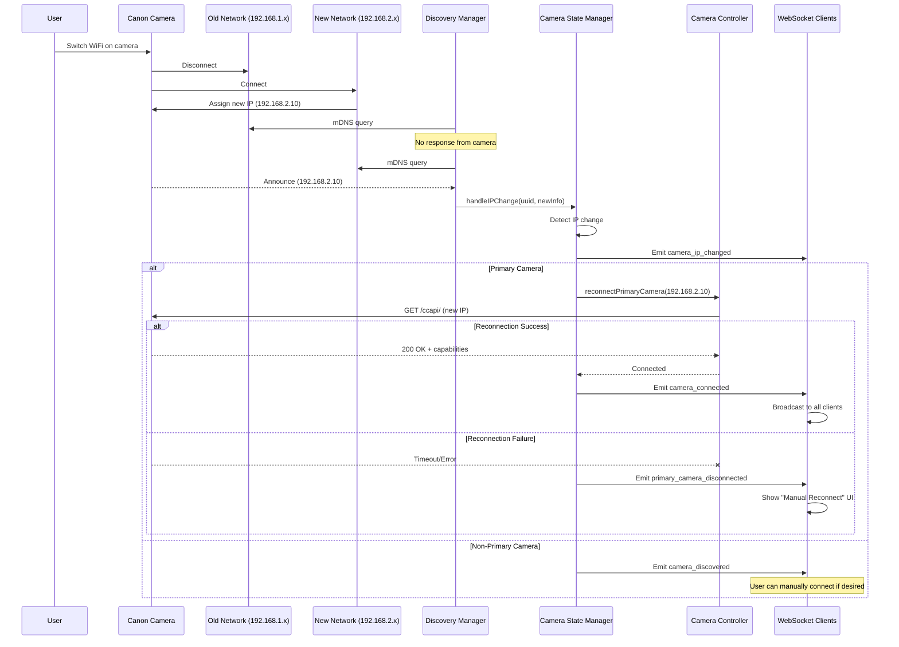

# Network Transition Handling

**Version:** 1.0
**Date:** 2025-09-29
**Status:** Complete

## Overview

This document describes how the pi-camera-control system handles network transitions, including camera IP address changes and automatic reconnection.

**Important Limitations:**
- **User-initiated network switching during operations is NOT RECOMMENDED**
- Network transitions may cause 1-2 photo loss during intervalometer sessions
- This is a hobbyist tool - network changes are handled gracefully but not seamlessly
- Emphasis on detecting and reporting issues, not hiding them with complex recovery

**What IS Supported:**
- Automatic camera IP change detection via mDNS
- Automatic reconnection to primary camera on IP change
- Session continuity with minimal disruption (1-2 photo loss typical)

**What is NOT Supported:**
- Seamless network switching during active shooting
- Zero photo loss during network transitions
- User deliberately switching networks mid-operation (not recommended)

---

## Camera Discovery and IP Tracking

### mDNS Camera Discovery

The system continuously discovers cameras on the network using mDNS (Multicast DNS):


**Discovery Frequency:**
```javascript
// src/camera/discovery-manager.js
const DISCOVERY_INTERVAL = 30000; // 30 seconds
```

**Camera Identification:**
- UUID (from mDNS TXT record)
- Model name
- Firmware version
- IP address
- Port (typically 443)

### IP Address Tracking

The system maintains a map of last known IP addresses:

```javascript
// src/camera/state-manager.js
this.lastKnownIPs = new Map(); // uuid -> ipAddress
```

**IP Change Detection:**
```javascript
// src/camera/state-manager.js:55-73
handleIPChange(uuid, deviceInfo) {
  const lastIP = this.lastKnownIPs.get(uuid);

  if (lastIP && lastIP !== deviceInfo.ipAddress) {
    logger.warn(`Camera ${uuid} IP changed from ${lastIP} to ${deviceInfo.ipAddress}`);

    this.emit("cameraIPChanged", {
      uuid,
      oldIP: lastIP,
      newIP: deviceInfo.ipAddress,
    });

    // If this is our primary camera, we need to reconnect
    if (uuid === this.primaryCameraUuid && this.primaryController) {
      // ... reconnection logic
    }
  }

  this.lastKnownIPs.set(uuid, deviceInfo.ipAddress);
}
```

---

## Network Transition Scenarios

### Scenario 1: Camera Switches Networks

**Trigger:** Camera manually switched from one WiFi network to another



**Implementation:**
```javascript
// src/camera/state-manager.js:74-106
if (uuid === this.primaryCameraUuid && this.primaryController) {
  logger.info(
    `Primary camera IP changed, reconnecting from ${lastIP} to ${deviceInfo.ipAddress}...`
  );
  try {
    await this.reconnectPrimaryCamera(
      deviceInfo.ipAddress,
      deviceInfo.port || "443"
    );
    logger.info(
      `Primary camera successfully reconnected to ${deviceInfo.ipAddress}`
    );
  } catch (error) {
    logger.error(
      `Failed to reconnect primary camera to new IP ${deviceInfo.ipAddress}:`,
      error
    );
    // Emit disconnection event so UI can show manual connect option
    this.emit("primaryCameraDisconnected", {
      uuid,
      reason: "ip_change_reconnect_failed",
    });
  }
}
```

### Scenario 2: Pi Switches Networks

**Trigger:** Raspberry Pi switches from one WiFi to another (e.g., from home WiFi to camera AP)


**Key Point:** Pi network changes trigger same IP change detection as camera network changes.

### Scenario 3: DHCP Lease Renewal Changes IP

**Trigger:** Camera receives new IP from DHCP server after lease renewal


**Mitigation:**
- mDNS re-discovery every 30 seconds catches changes quickly
- Automatic reconnection for primary camera
- No user intervention required (usually)

---

## Reconnection Process

### Primary Camera Reconnection


**Implementation:**
```javascript
// src/camera/state-manager.js:115-158
async reconnectPrimaryCamera(newIP, newPort = "443") {
  logger.info(`Reconnecting primary camera to new IP ${newIP}:${newPort}...`);

  // Create new controller with new IP
  const newController = new CameraController(newIP, newPort);

  // Set up callbacks before initializing
  newController.onDisconnect = (status) => {
    logger.warn("Primary camera disconnected:", status);
    this.emit("primaryCameraDisconnected", {
      uuid: this.primaryCameraUuid,
      reason: "connection_lost",
      status,
    });
  };

  // Initialize new controller
  await newController.initialize();

  // If we had an old controller, replace it
  if (this.primaryController) {
    logger.debug("Replacing old primary controller");
  }

  // Update primary controller
  this.primaryController = newController;

  // Update camera data
  const cameraData = this.discoveredCameras.get(this.primaryCameraUuid);
  if (cameraData) {
    cameraData.info.ipAddress = newIP;
    cameraData.info.port = newPort;
    cameraData.info.ccapiUrl = `https://${newIP}:${newPort}/ccapi/`;
  }

  logger.info(`Primary camera reconnected successfully to ${newIP}`);

  // Emit connection event
  this.emit("primaryCameraConnected", {
    uuid: this.primaryCameraUuid,
    ip: newIP,
    port: newPort,
  });
}
```

**Reconnection Strategy:**
- Create new controller instance (old IP no longer valid)
- Initialize and verify connection
- Replace old controller reference
- Update camera data with new IP
- Emit events to notify clients

### Non-Primary Camera Handling

Non-primary cameras (discovered but not connected) are simply updated:

```javascript
// IP change detected but no active connection
this.lastKnownIPs.set(uuid, deviceInfo.ipAddress);

this.emit("cameraDiscovered", {
  uuid,
  info: deviceInfo,
});
```

User can manually connect to the camera at its new IP if desired.

---

## Session Continuity During Transitions

### Active Intervalometer Session

**Question:** What happens to an active intervalometer session when network transitions occur?


**Behavior:**
1. **Photo in progress**: May fail with network error
2. **Failed photo**: Counted as failed shot
3. **Session continues**: Next interval uses new controller
4. **Automatic recovery**: New controller reconnected by time of next shot

**Session Impact:**
- Lost shots: Typically 1-2 photos during transition
- Session continues: Interval timer not affected
- Statistics updated: Failed shots logged
- User notification: Error events broadcast

**Code Reference:**
```javascript
// Session doesn't know about IP changes
// It calls controller.takePhoto() each interval
// Controller handles connection automatically

// If photo fails:
catch (error) {
  this.stats.shotsFailed++;
  this.emit("photo_failed", {
    error: error.message,
    shotNumber: this.stats.currentShot,
  });
}
```

### Connection Monitoring Pause

During photo operations, connection monitoring is paused:

```javascript
// src/camera/controller.js:584-594
pauseConnectionMonitoring() {
  logger.debug("Pausing camera connection monitoring during photo operation");
  this.monitoringPaused = true;
  this.consecutiveFailures = 0;
}
```

**Why Pause:**
- Long exposures (30+ seconds) would trigger false disconnection
- Photo timeout (30s) is longer than monitoring interval
- Prevents duplicate error handling

**Impact on Reconnection:**
- IP change detection still works (via mDNS)
- Reconnection still happens (via StateManager)
- Only connection health checks are paused

---

## Timeout and Retry Logic

### Camera Operation Timeouts

Different operations have different timeout values:

```javascript
// Connection/Discovery
const response = await this.client.get(`${this.baseUrl}/ccapi/`, {
  timeout: 10000  // 10 seconds (default)
});

// Photo Operations
const response = await this.client.post(
  `${this.baseUrl}${this.shutterEndpoint}`,
  payload,
  {
    timeout: 30000  // 30 seconds (long exposures)
  }
);

// Shutter Release
const response = await this.client.post(
  `${this.baseUrl}${this.shutterEndpoint}`,
  payload,
  {
    timeout: 15000  // 15 seconds
  }
);
```

**Timeout Rationale:**
- **10s default**: Adequate for status queries and discovery
- **30s photo**: Handles long manual exposures (e.g., 20s exposure)
- **15s release**: Shorter since release is quick operation

### No Automatic Retry

**Important:** The system does **NOT** automatically retry failed operations:

- ❌ No retry loops on photo capture failure
- ❌ No retry on connection failure
- ❌ No exponential backoff

**Rationale:**
1. **Intervalometer handles retries**: Next interval is natural retry
2. **Avoid cascading failures**: Don't pile up retries during outage
3. **User control**: Let user decide when to retry
4. **Clear state**: Failed operations are logged and reported

**Exception:** Reconnection on IP change is automatic (one attempt only)

---

## mDNS Discovery Details

### Service Type

The system searches for Canon cameras via mDNS service type:

```javascript
const SERVICE_TYPE = "_ccapi._tcp.local";
```

**Why this service type:**
- Canon cameras advertise CCAPI availability via mDNS
- Standard service name across Canon camera models
- Allows discovery without knowing IP addresses

### Discovery Data

mDNS provides:

**Service Instance Name:**
```
Canon EOS R50 (12:34:56:78:9A:BC)._ccapi._tcp.local
```

**TXT Record Data:**
```javascript
{
  uuid: "00000000-0000-1000-8000-123456789ABC",
  model: "Canon EOS R50",
  firmware: "1.2.0",
  // ... other camera-specific data
}
```

**Network Data:**
- IP Address: 192.168.1.100
- Port: 443 (HTTPS)
- Hostname: camera.local

### Discovery Interval

```javascript
// src/camera/discovery-manager.js
const DISCOVERY_INTERVAL = 30000; // 30 seconds
```

**Trade-offs:**
- **30s interval**: Good balance between responsiveness and network overhead
- **Faster (10s)**: Would catch IP changes quicker but more network traffic
- **Slower (60s)**: Less network overhead but slower IP change detection

**IP Change Detection Latency:**
- Best case: ~30 seconds (camera changes right after last scan)
- Worst case: ~60 seconds (camera changes right after last scan, next scan in 30s)
- Average: ~45 seconds

---

## Network Configuration Changes

### Pi Network Switch via Web UI

When user switches Pi's network via web interface:


**Connection Verification:**
```javascript
// src/network/service-manager.js
// After nmcli connect, verify connection
const verifyResult = await this.verifyConnection(ssid);

if (verifyResult.connected && verifyResult.ssid === ssid) {
  return {
    success: true,
    ssid: verifyResult.ssid,
    ipAddress: verifyResult.ipAddress,
    signalStrength: verifyResult.signalStrength,
  };
}
```

**Client Impact:**
- WebSocket connection drops (Pi IP changed)
- Client must reconnect to Pi's new IP
- UI should handle reconnection automatically
- User may need to update bookmark/URL

---

## Edge Cases and Failure Modes

### 1. IP Change During Photo Capture

**Scenario:** Camera IP changes while long exposure in progress

**Behavior:**
- Current photo operation fails with timeout
- Counted as failed shot
- Reconnection happens
- Next interval succeeds

**User Impact:**
- One lost photo
- Session continues
- No data loss

### 2. Rapid IP Changes

**Scenario:** Camera IP changes multiple times quickly (e.g., DHCP server misbehavior)

**Behavior:**
- Each change triggers reconnection
- Last IP wins
- Intermediate IPs may cause failed operations

**Mitigation:**
- mDNS discovery is authoritative
- System always uses latest discovered IP
- No stale IP caching

### 3. Split Network (Camera and Pi on Different Subnets)

**Scenario:** Camera and Pi on different networks with no routing

**Behavior:**
- mDNS may not work across subnets
- Camera not discovered
- No connection possible

**Solution:**
- Both must be on same network
- Use camera's AP mode
- Or both connect to same WiFi

### 4. Multiple Cameras with IP Changes

**Scenario:** Multiple cameras on network, one changes IP

**Behavior:**
- Only primary camera reconnects automatically
- Non-primary cameras updated in discovered list
- User can manually connect to any camera

### 5. Reconnection Failure

**Scenario:** Auto-reconnection to new IP fails

**Behavior:**
```javascript
catch (error) {
  logger.error(
    `Failed to reconnect primary camera to new IP ${deviceInfo.ipAddress}:`,
    error
  );
  this.emit("primaryCameraDisconnected", {
    uuid,
    reason: "ip_change_reconnect_failed",
  });
}
```

**User Action:**
- UI shows "Camera Disconnected"
- User can manually reconnect
- Fallback to normal connection flow

---

## Summary

### Automatic Handling

The system **automatically** handles:

- ✅ Camera IP address changes (via mDNS)
- ✅ Primary camera reconnection
- ✅ Network transition detection
- ✅ Session continuity (with minimal photo loss)
- ✅ Updated camera data

### Manual Handling Required

The system **requires user action** for:

- ❌ Pi network switch (client must reconnect to new Pi IP)
- ❌ Reconnection failure (manual connect option shown)
- ❌ Non-primary camera IP changes (user decides if/when to connect)

### Design Trade-offs

| Decision | Rationale |
|----------|-----------|
| **30s mDNS interval** | Balance between responsiveness and network overhead |
| **Automatic primary reconnection** | User expects camera to "just work" for unintentional IP changes |
| **No automatic Pi network handling** | Pi IP change affects WebSocket, requires client-side handling |
| **No retry loops** | Intervalometer provides natural retry cadence |
| **Single reconnection attempt** | Avoid cascading failures during network issues |
| **User-initiated switches discouraged** | Deliberate network changes during operations not supported |

### Key Characteristics

- **Resilient:** Handles unintentional network transitions (DHCP changes, etc.)
- **Predictable:** IP changes detected within ~30-60 seconds
- **Best-effort:** Sessions survive transitions with typical 1-2 photo loss
- **Clear reporting:** Failures are reported, not hidden
- **Transparent:** Events keep clients informed of network state

**Philosophy:** For a hobbyist tool, **detecting and reporting network issues is more important than seamless recovery**. Users should avoid network switching during active operations.

---

**Last Updated:** 2025-09-29
**Implementation Files:**
- `src/camera/discovery-manager.js` - mDNS camera discovery
- `src/camera/state-manager.js` - IP change detection and reconnection
- `src/camera/controller.js` - Connection management and timeouts
- `src/network/service-manager.js` - Pi network configuration
- `src/intervalometer/session.js` - Session continuity during transitions