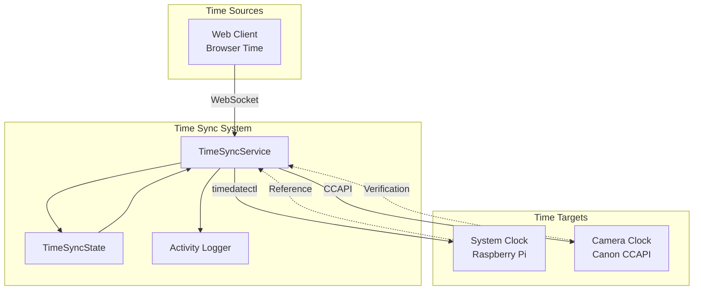

# Time Synchronization System

## Overview

The Time Synchronization System ensures accurate timekeeping across the Pi Camera Control system, including the 
Raspberry Pi controller and connected Canon cameras. The Raspberry Pi does not have a battery back up for its
RTC. When in the field with no Wi-Fi connection, other than the UI there is no way to check or set the system
time. We only allow clients connected via the access point to sync because they must be physically close to 
the Pi to connect. This assures that they are in the same timezone and under the control of the operator of the Pi.

## Architecture

### Components

#### TimeSyncService (`src/timesync/service.js`)
The main service responsible for time synchronization operations:
- Client-server time synchronization protocol
- Camera time synchronization via CCAPI
- Manual time setting capabilities
- Activity logging for synchronization events

#### TimeSyncState (`src/timesync/state.js`)
State management for time synchronization:
- Tracks synchronization status
- Monitors reliability levels
- Maintains activity log
- Provides synchronization state to other components

### System Design



## Synchronization Protocol

### Client-Server Synchronization

The system implements a simple time synchronization protocol over WebSocket:

1. **Time Request Phase**
   ```javascript
   // Server sends time sync request
   {
     type: "time-sync-request",
     serverTime: 1704110400000,  // Server timestamp in ms
     requestId: "sync-123"
   }
   ```

2. **Client Response Phase**
   ```javascript
   // Client responds with its time
   {
     type: "time-sync-response",
     data: {
       clientTime: 1704110401000,  // Client timestamp in ms
       serverTime: 1704110400000,  // Echo of server time
       requestId: "sync-123"
     }
   }
   ```

3. **Offset Calculation**
   - Calculate round-trip time (RTT)
   - Determine clock offset accounting for network latency
   - Apply offset if above threshold (default: 1000ms)

### Camera Synchronization

Camera time synchronization uses the Canon CCAPI:

1. **Get Camera Time**
   ```http
   GET https://{camera-ip}/ccapi/ver100/deviceinformation/datetime
   ```

2. **Set Camera Time**
   ```http
   PUT https://{camera-ip}/ccapi/ver100/functions/datetime
   Content-Type: application/json

   {
     "datetime": "2024-01-01T12:00:00",
     "timezone": "+00:00"
   }
   ```

3. **Verification**
   - Read back camera time after setting
   - Log offset and success/failure
   - Update synchronization state

## State Management

### Synchronization States

```javascript
{
  isSynchronized: boolean,      // Overall sync status
  lastSyncTime: Date,           // Last successful sync
  syncSource: string,           // "client" | "manual" | "none"
  reliability: string,          // "high" | "medium" | "low" | "none"
  activityLog: Array            // Recent sync activities
}
```

### Reliability Levels

- **High**: Synchronized within last 5 minutes
- **Medium**: Synchronized within last hour
- **Low**: Synchronized more than 1 hour ago
- **None**: Never synchronized or sync failed

## WebSocket Protocol

### Client to Server Messages

#### Time Sync Response
```json
{
  "type": "time-sync-response",
  "data": {
    "clientTime": 1704110401000,
    "serverTime": 1704110400000,
    "requestId": "sync-123"
  }
}
```

#### Manual Time Sync
```json
{
  "type": "manual-time-sync",
  "data": {
    "timestamp": "2024-01-01T12:00:00.000Z",
    "timezone": "America/Los_Angeles"
  }
}
```

#### Get Time Sync Status
```json
{
  "type": "get-time-sync-status",
  "data": {}
}
```

### Server to Client Messages

#### Time Sync Request
```json
{
  "type": "time-sync-request",
  "serverTime": 1704110400000,
  "requestId": "sync-123"
}
```

#### Pi Sync Event
```json
{
  "type": "event",
  "eventType": "pi-sync",
  "timestamp": "2024-01-01T12:00:00.000Z",
  "data": {
    "synchronized": true,
    "source": "client",
    "offset": 1500,
    "reliability": "high"
  }
}
```

#### Camera Sync Event
```json
{
  "type": "event",
  "eventType": "camera-sync",
  "timestamp": "2024-01-01T12:00:00.000Z",
  "data": {
    "success": true,
    "previousTime": "2024-01-01T11:59:58.000Z",
    "newTime": "2024-01-01T12:00:00.000Z",
    "offset": 2000
  }
}
```

#### Reliability Lost Event
```json
{
  "type": "event",
  "eventType": "reliability-lost",
  "timestamp": "2024-01-01T12:00:00.000Z",
  "data": {
    "lastSyncTime": "2024-01-01T10:00:00.000Z",
    "reliability": "low"
  }
}
```

#### Activity Log Update
```json
{
  "type": "activity_log",
  "timestamp": "2024-01-01T12:00:00.000Z",
  "data": {
    "entries": [
      {
        "timestamp": "2024-01-01T12:00:00.000Z",
        "type": "sync",
        "message": "Time synchronized from client (offset: 1500ms)",
        "success": true
      }
    ]
  }
}
```

## API Endpoints

### Get System Time
```http
GET /api/system/time
```
Returns current system time and timezone.

### Set System Time
```http
POST /api/system/time
Content-Type: application/json

{
  "timestamp": "2024-01-01T12:00:00.000Z",
  "timezone": "America/Los_Angeles"
}
```
Manually sets system time.

### Get Time Sync Status
```http
GET /api/timesync/status
```
Returns current synchronization status and activity log.

### Sync Camera Time
```http
POST /api/timesync/camera
```
Synchronizes camera time with system time.

## Implementation Details

### Automatic Synchronization

1. **On Client Connection**
   - Automatically initiate time sync when web client connects
   - Use first connected client as time source
   - Log synchronization activity

2. **Periodic Sync**
   - Re-sync every 30 minutes while client connected
   - Update reliability status based on sync age
   - Broadcast reliability warnings when sync becomes stale

3. **Camera Sync Trigger**
   - Sync camera time when camera first connects
   - Re-sync before starting timelapse session
   - Option for manual camera sync via UI

### Client User Interface

* **Controller Status**
  * Camera Status
    * `TimeSync:` _TimeSyncStatus of camera_ or blank if no camera connected
  * Controller Info
    * `TimeSync:` _TimeSyncStatus of controller_ 

### Error Handling

**Philosophy:** This is a hobbyist tool, not mission-critical. **Report failures to user clearly** rather than hiding them with complex retry logic. Hidden problems don't get fixed.

1. **Network Failures**
   - Log failures to activity log
   - Display error to user in web UI
   - Degrade reliability status
   - Note: No automatic retry - user can manually retry if needed

2. **Camera Sync Failures**
   - Log camera sync errors with details
   - Display error to user in web UI
   - Continue operation with warning
   - User can manually retry camera sync if needed

3. **System Time Failures**
   - Log permission errors for timedatectl
   - Notify user of sync limitations
   - No automatic fallbacks - clear error notification is priority

## Activity Logging

The system maintains an activity log for debugging and user visibility:

```javascript
{
  timestamp: Date,
  type: "sync" | "error" | "manual" | "camera",
  message: string,
  success: boolean,
  details: {
    source?: string,
    offset?: number,
    error?: string
  }
}
```

### Log Retention
- Keep last 100 entries in memory
- Clear log on service restart
- Include in status broadcasts for UI display

## Configuration

### Environment Variables
```bash
# Time sync configuration
TIME_SYNC_THRESHOLD=1000        # Minimum offset (ms) to trigger sync
TIME_SYNC_INTERVAL=1800000      # Re-sync interval (30 minutes)
TIME_SYNC_RETRY_DELAY=5000      # Retry delay for failed syncs
```

### Default Settings
```javascript
{
  autoSync: true,               // Auto-sync on client connect
  syncThreshold: 1000,          // 1 second threshold
  syncInterval: 30 * 60 * 1000, // 30 minutes
  maxActivityLog: 100,          // Max log entries
  cameraSyncOnConnect: true     // Sync camera on connection
}
```

## Testing Considerations

### Unit Tests
- Mock system time operations
- Test offset calculations
- Verify state transitions
- Test activity logging

### Integration Tests
- Test WebSocket message flow
- Verify camera sync with mock CCAPI
- Test system time setting (with permissions)
- Validate error handling paths

### Manual Testing
- Test with various time offsets
- Verify camera sync accuracy
- Test network disconnection scenarios
- Validate UI activity log display

## Known Issues

1. **Documentation Gap**
   - This system was implemented without design documentation
   - WebSocket protocol evolved organically
   - Need to maintain this document with implementation changes