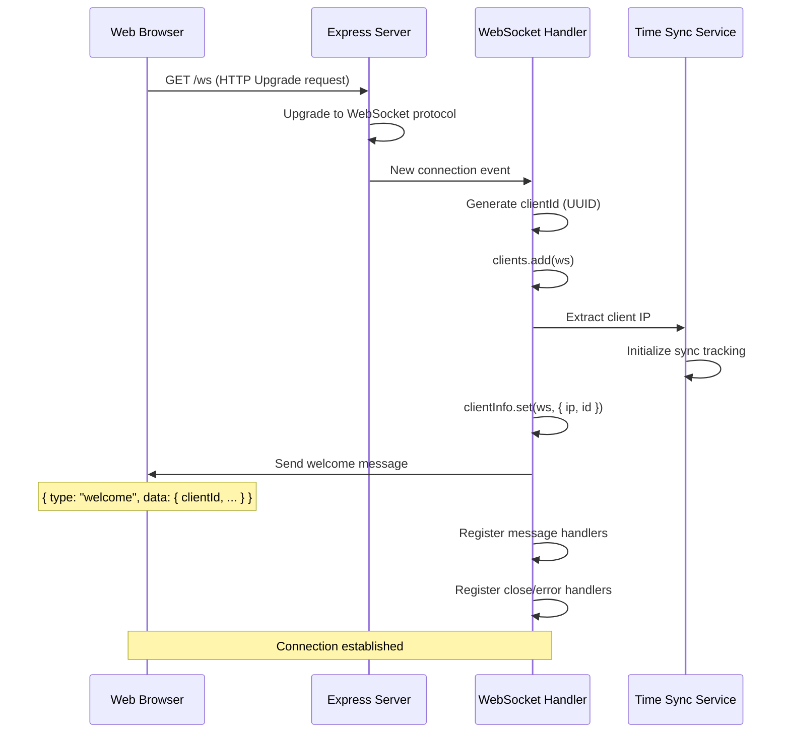
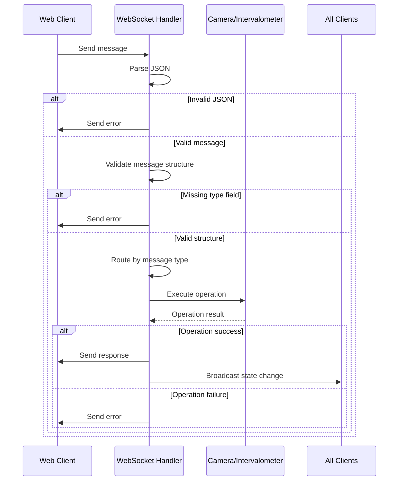
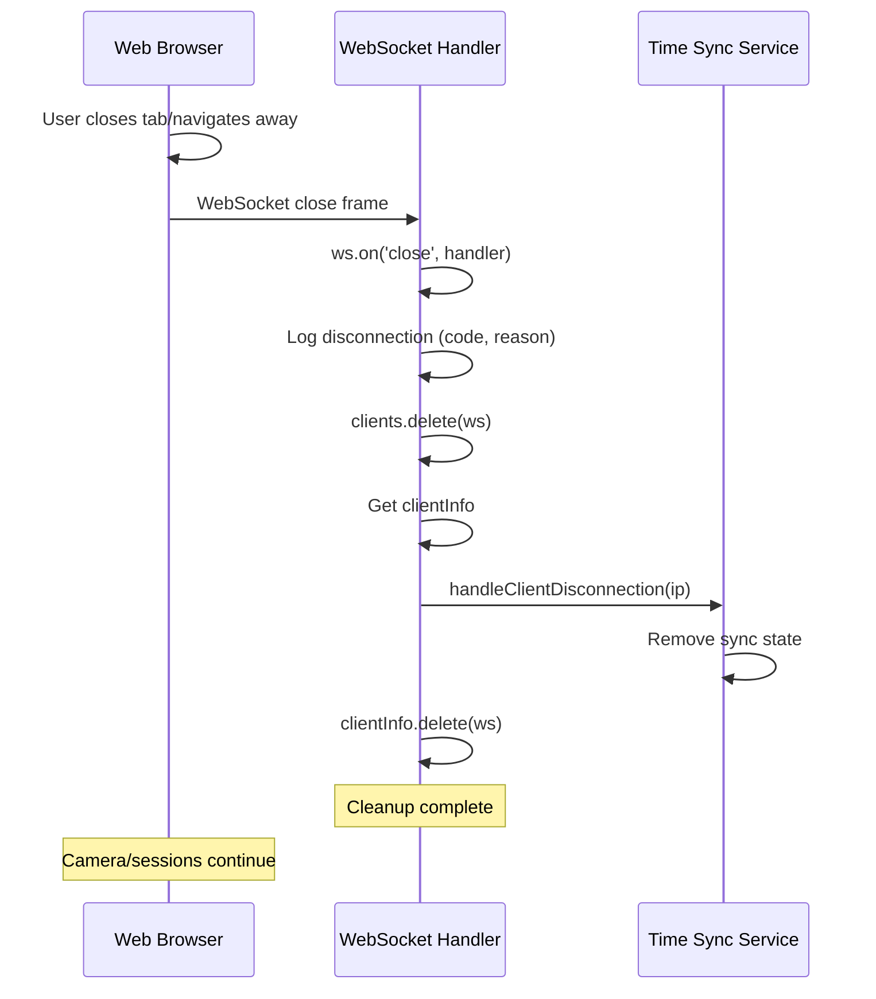

# WebSocket Connection Lifecycle

**Version:** 1.0
**Date:** 2025-09-29
**Status:** Complete

## Overview

This document describes the complete lifecycle of WebSocket connections in the pi-camera-control system, from initial connection through normal operation to disconnection and cleanup.

---

## Connection Establishment

### Server Setup

The WebSocket server is created alongside the Express HTTP server:

```javascript
// src/server.js:49-58
const wss = new WebSocketServer({
  server: this.httpServer,
  path: "/ws"
});

wss.on("connection", (ws, req) => {
  const clientIp = req.socket.remoteAddress;
  logger.info(`New WebSocket connection from ${clientIp}`);
  websocketHandler.handleConnection(ws, req);
});
```

**Server Configuration:**
- **Path:** `/ws`
- **Protocol:** WebSocket over HTTP (upgrades from HTTP connection)
- **No Authentication:** Open to all clients on the network
- **No TLS:** Uses plain HTTP (camera control is local network only)

### Client Connection Flow



**Welcome Message:**
```javascript
// src/websocket/handler.js:248-261
const welcomeMessage = {
  type: "welcome",
  data: {
    clientId,
    message: "Connected to pi-camera-control WebSocket server",
    serverTime: new Date().toISOString(),
    availableCommands: [
      "get_camera_status",
      "take_photo",
      "start_intervalometer",
      // ... full command list
    ],
  },
};

ws.send(JSON.stringify(welcomeMessage));
```

### Connection Tracking

The system maintains two data structures for active connections:

**1. Active Clients Set:**
```javascript
const clients = new Set();  // Set of WebSocket instances
```

**2. Client Info Map:**
```javascript
const clientInfo = new Map();  // ws -> { ip, id }
```

**Benefits:**
- Set for fast broadcast iteration
- Map for metadata lookup
- Automatic cleanup when connection closes

---

## Authentication and Authorization

### Current Implementation: No Authentication

The system currently implements **no authentication or authorization**:

- ✅ Any client on the network can connect
- ✅ All connected clients have full control
- ✅ No user accounts or sessions
- ✅ No API keys or tokens

**Rationale:**
- System designed for single-user, private network operation
- Camera control is inherently local (camera's own WiFi or local network)
- Physical access to network implies authorized user
- Simplifies mobile UI (no login screen needed in field)

### Future Considerations

If multi-user or security requirements emerge:

**Option 1: Simple Token Authentication**
```javascript
// Hypothetical implementation
ws.on("message", async (data) => {
  const message = JSON.parse(data);

  if (message.type === "authenticate") {
    const isValid = await validateToken(message.token);
    if (isValid) {
      clientInfo.set(ws, { ...clientInfo.get(ws), authenticated: true });
      sendResponse(ws, "auth_success", {});
    } else {
      ws.close(4001, "Authentication failed");
    }
  }

  // Require authentication for control messages
  if (isControlMessage(message.type)) {
    const info = clientInfo.get(ws);
    if (!info.authenticated) {
      sendError(ws, "Authentication required");
      return;
    }
  }
});
```

**Option 2: Role-Based Access**
- Read-only observers (monitoring only)
- Operators (full control)
- Different tokens for different roles

---

## Message Handling

### Message Flow



**Message Format:**
```javascript
// Client sends:
{
  "type": "start_intervalometer",
  "data": {
    "interval": 10,
    "totalShots": 100
  }
}

// Server responds:
{
  "type": "intervalometer_started",
  "data": {
    "sessionId": "uuid",
    "interval": 10,
    "totalShots": 100,
    "startTime": "2025-09-29T12:00:00.000Z"
  }
}
```

### Message Types

**Client → Server (Commands):**
- `take_photo` - Capture single photo
- `start_intervalometer` - Start timelapse session
- `stop_intervalometer` - Stop current session
- `get_camera_status` - Request camera status
- `validate_interval` - Validate timing settings
- `network_scan` - Scan for WiFi networks
- `network_connect` - Connect to WiFi
- `get_unsaved_session` - Check for unsaved session

**Server → Client (Events):**
- `welcome` - Initial connection confirmation
- `camera_status` - Camera status update
- `photo_taken` - Photo captured successfully
- `intervalometer_started` - Session started
- `intervalometer_update` - Session progress
- `intervalometer_completed` - Session finished
- `unsaved_session_found` - Recovery available
- `error` - Operation failed

### Error Response Format

Standardized error responses:

```javascript
// src/utils/error-handlers.js
function sendError(ws, message, details = null) {
  const errorMessage = {
    type: "error",
    data: {
      message,
      timestamp: new Date().toISOString(),
      ...(details && { details }),
    },
  };
  ws.send(JSON.stringify(errorMessage));
}
```

**Example Error:**
```json
{
  "type": "error",
  "data": {
    "message": "Camera not connected",
    "timestamp": "2025-09-29T12:00:00.000Z",
    "details": {
      "operation": "take_photo",
      "lastError": "ETIMEDOUT"
    }
  }
}
```

---

## Broadcasting to Multiple Clients

### Broadcast Mechanism

The system broadcasts state changes to all connected clients:

```javascript
// src/websocket/handler.js:87-97
const broadcast = (message) => {
  const messageStr = JSON.stringify(message);
  logger.debug(`Broadcasting to ${clients.size} clients:`, message.type);

  clients.forEach((client) => {
    if (client.readyState === WebSocket.OPEN) {
      try {
        client.send(messageStr);
      } catch (error) {
        logger.error(`Error broadcasting to client:`, error);
      }
    }
  });
};
```

**Broadcast Types:**

1. **Camera Events:**
   - `camera_discovered`
   - `camera_connected` / `camera_disconnected`
   - `camera_status` (periodic updates)
   - `camera_ip_changed`

2. **Intervalometer Events:**
   - `intervalometer_started` / `intervalometer_stopped`
   - `intervalometer_update` (progress)
   - `intervalometer_completed`
   - `photo_taken` (each shot)

3. **System Events:**
   - `unsaved_session_found` (startup recovery)
   - `time_sync_status`

**Broadcast Frequency:**
- Camera status: Every 30 seconds (polling interval)
- Intervalometer updates: Every photo (variable based on interval)
- Connection events: Immediate
- Time sync: On significant changes only

### Selective Broadcasting

Currently all clients receive all broadcasts. Future enhancement could implement:

```javascript
// Hypothetical selective broadcast
function broadcastToRole(message, requiredRole) {
  clients.forEach((client) => {
    const info = clientInfo.get(client);
    if (info.role === requiredRole || requiredRole === 'all') {
      client.send(JSON.stringify(message));
    }
  });
}
```

---

## Connection Monitoring

### No Heartbeat/Ping-Pong Mechanism

The system does **NOT** implement explicit WebSocket heartbeat:

- ❌ No ping/pong frames
- ❌ No timeout tracking
- ❌ No connection health checks

**Rationale:**
- TCP keep-alive handles connection health at transport layer
- Browser/Node.js WebSocket implementations handle connection drops
- Close event fires reliably when connection dies
- Simplified implementation for local network use

**TCP Handling:**
- OS-level TCP keep-alive packets
- Browser automatically detects broken connections
- `close` event fires on connection loss
- Cleanup happens in close handler

### Connection State Detection

```javascript
// Check if client can receive messages
if (client.readyState === WebSocket.OPEN) {
  client.send(message);
}
```

**WebSocket Ready States:**
- `CONNECTING (0)` - Connection being established
- `OPEN (1)` - Connection open and ready
- `CLOSING (2)` - Connection closing
- `CLOSED (3)` - Connection closed

---

## Disconnection and Cleanup

### Normal Disconnection



**Close Codes:**
- `1000` - Normal closure
- `1001` - Going away (page navigation)
- `1006` - Abnormal closure (no close frame)
- `1011` - Server error

### Error Disconnection

```javascript
// src/websocket/handler.js:304-315
ws.on("error", (error) => {
  logger.error(`WebSocket error for ${clientId}:`, error);
  clients.delete(ws);

  // Clean up time sync tracking
  const info = clientInfo.get(ws);
  if (info) {
    timeSyncService.handleClientDisconnection(info.ip);
    clientInfo.delete(ws);
  }
});
```

**Error Scenarios:**
- Network interruption
- Protocol violations
- Message parsing failures
- TCP errors

### Cleanup Checklist

When a client disconnects (normal or error):

- ✅ Remove from `clients` Set
- ✅ Clean up time sync tracking
- ✅ Remove from `clientInfo` Map
- ❌ Do NOT stop intervalometer sessions
- ❌ Do NOT disconnect camera
- ❌ Do NOT affect other clients

**Important:**
- Sessions continue running even with no connected clients
- Camera remains connected
- Clients can reconnect and resume monitoring

---

## Connection Limits and Scalability

### Current Limits

**No Hard Limits Implemented:**
- Unlimited concurrent connections accepted
- No rate limiting on messages
- No per-client message queues
- No connection throttling

**Practical Limits:**
- Memory: Each client uses ~few KB (Set entry + Map entry)
- CPU: Broadcast to N clients is O(N) operation
- Network: All clients receive all broadcasts

**Expected Usage:**
- 1-3 concurrent clients typical (phone, tablet, laptop)
- Low message rate (status updates every 30s)
- Broadcast size: ~1-5KB per message
- System easily handles expected load

### Future Scalability Considerations

If supporting more clients becomes necessary:

**Option 1: Connection Limit**
```javascript
const MAX_CLIENTS = 10;

wss.on("connection", (ws, req) => {
  if (clients.size >= MAX_CLIENTS) {
    ws.close(1008, "Server at capacity");
    return;
  }
  // ... proceed with connection
});
```

**Option 2: Rate Limiting**
```javascript
const rateLimiter = new Map(); // clientId -> { count, resetTime }

function checkRateLimit(clientId) {
  const now = Date.now();
  const limit = rateLimiter.get(clientId);

  if (!limit || now > limit.resetTime) {
    rateLimiter.set(clientId, { count: 1, resetTime: now + 60000 });
    return true;
  }

  if (limit.count >= 100) { // 100 messages per minute
    return false;
  }

  limit.count++;
  return true;
}
```

**Option 3: Selective Updates**
```javascript
// Send status only to clients who requested it recently
const interestedClients = new Set();

// Client subscribes
ws.on("message", (data) => {
  const msg = JSON.parse(data);
  if (msg.type === "subscribe_status") {
    interestedClients.add(ws);
  }
});

// Broadcast only to interested clients
function broadcastStatus(statusData) {
  interestedClients.forEach(client => {
    if (client.readyState === WebSocket.OPEN) {
      client.send(JSON.stringify(statusData));
    }
  });
}
```

---

## Connection Recovery (Client-Side)

### Server Does Not Track Client State

**Important:** The server is stateless regarding client connections:
- No session IDs stored server-side
- No client preferences remembered
- Each connection is independent
- Clients must re-establish state after reconnect

### Client Reconnection Pattern

Recommended client-side implementation:

```javascript
// Hypothetical client code
class WebSocketClient {
  constructor(url) {
    this.url = url;
    this.ws = null;
    this.reconnectDelay = 1000;
    this.maxReconnectDelay = 30000;
  }

  connect() {
    this.ws = new WebSocket(this.url);

    this.ws.onopen = () => {
      console.log('Connected');
      this.reconnectDelay = 1000; // Reset delay
      this.requestInitialState();
    };

    this.ws.onclose = () => {
      console.log('Disconnected, reconnecting...');
      setTimeout(() => this.connect(), this.reconnectDelay);
      this.reconnectDelay = Math.min(this.reconnectDelay * 2, this.maxReconnectDelay);
    };

    this.ws.onerror = (error) => {
      console.error('WebSocket error:', error);
    };

    this.ws.onmessage = (event) => {
      this.handleMessage(JSON.parse(event.data));
    };
  }

  requestInitialState() {
    // Re-request current state after reconnect
    this.send({ type: 'get_camera_status' });
    this.send({ type: 'get_intervalometer_status' });
    this.send({ type: 'get_unsaved_session' });
  }
}
```

**Client Responsibilities:**
- Detect disconnection
- Implement exponential backoff reconnection
- Re-request state after reconnect
- Handle stale data from before disconnect

---

## Security Considerations

### Current Security Model

**Trust Assumptions:**
- Local network is trusted
- Physical access to network implies authorized user
- No malicious clients on camera network
- Camera itself has no security (open WiFi or WPA-PSK)

**Attack Surface:**
- Open WebSocket endpoint (no auth)
- Clients can execute any camera operation
- No rate limiting on commands
- No audit logging of actions

### Potential Vulnerabilities

**1. Unauthorized Access:**
- Anyone on network can control camera
- Mitigation: Network isolation (camera AP or private network)

**2. Denial of Service:**
- Rapid connection attempts
- Message flooding
- Mitigation: Rate limiting, connection limits (not implemented)

**3. Message Injection:**
- Malformed JSON
- Invalid message types
- Mitigation: Input validation exists, JSON parsing in try/catch

**4. Information Disclosure:**
- Camera status visible to all clients
- Session data broadcasted openly
- Mitigation: Acceptable for single-user system

### Security Enhancements (Future)

If security requirements increase:

1. **Add Authentication:**
   - Token-based auth (JWT)
   - API key validation
   - See "Future Considerations" in Authentication section

2. **Add TLS:**
   - WSS (WebSocket Secure)
   - Requires certificate management
   - Protects against eavesdropping

3. **Add Rate Limiting:**
   - Per-client message limits
   - Connection attempt throttling
   - See "Future Scalability" section

4. **Add Audit Logging:**
   - Log all control commands
   - Track which client performed actions
   - Compliance/debugging

---

## Summary

### Key Characteristics

| Aspect | Current Implementation |
|--------|----------------------|
| **Authentication** | None - Open access |
| **Connection Tracking** | Set + Map (clients, clientInfo) |
| **Welcome Message** | Yes - with client ID and commands list |
| **Heartbeat** | No - relies on TCP |
| **Message Format** | JSON with type/data structure |
| **Error Handling** | Standardized error responses |
| **Broadcasting** | All clients receive all events |
| **Connection Limits** | None |
| **Rate Limiting** | None |
| **Security** | Trust local network |
| **State Management** | Stateless server, client requests state |

### Lifecycle Summary

```
┌─────────────────────────────────────────────────────────────┐
│                     WebSocket Lifecycle                       │
├─────────────────────────────────────────────────────────────┤
│                                                               │
│  1. Client connects → HTTP upgrade to WebSocket              │
│  2. Server generates client ID                               │
│  3. Server sends welcome message                             │
│  4. Connection registered in clients Set + clientInfo Map    │
│  5. Client sends commands → Server processes → Responds      │
│  6. Server broadcasts events → All clients receive           │
│  7. Client disconnects (normal/error) → Cleanup              │
│  8. Remove from Sets/Maps                                    │
│  9. Camera and sessions continue                             │
│                                                               │
└─────────────────────────────────────────────────────────────┘
```

### Design Philosophy

The WebSocket connection lifecycle follows these principles:

1. **Simple and Stateless**: Server doesn't track client preferences
2. **Broadcast by Default**: All clients see all state changes
3. **Fail Gracefully**: Connection drops don't affect operations
4. **Trust Local Network**: No authentication for simplicity
5. **Client Responsibility**: Clients handle reconnection and state recovery

This design prioritizes simplicity and reliability for the single-user, local network use case over complex authentication and state management.

---

**Last Updated:** 2025-09-29
**Implementation Files:**
- `src/server.js` - WebSocket server setup
- `src/websocket/handler.js` - Connection lifecycle and message handling
- `src/utils/error-handlers.js` - Standardized error responses
- `src/services/time-sync.js` - Client tracking for time sync