# WebSocket Sequence Diagrams

This document provides detailed sequence diagrams for all major WebSocket-based operations in the Pi Camera Control system. These diagrams show the complete flow of messages between client, WebSocket handler, managers, and hardware components.

## Connection and Initial Setup

### Client Connection and Welcome Flow

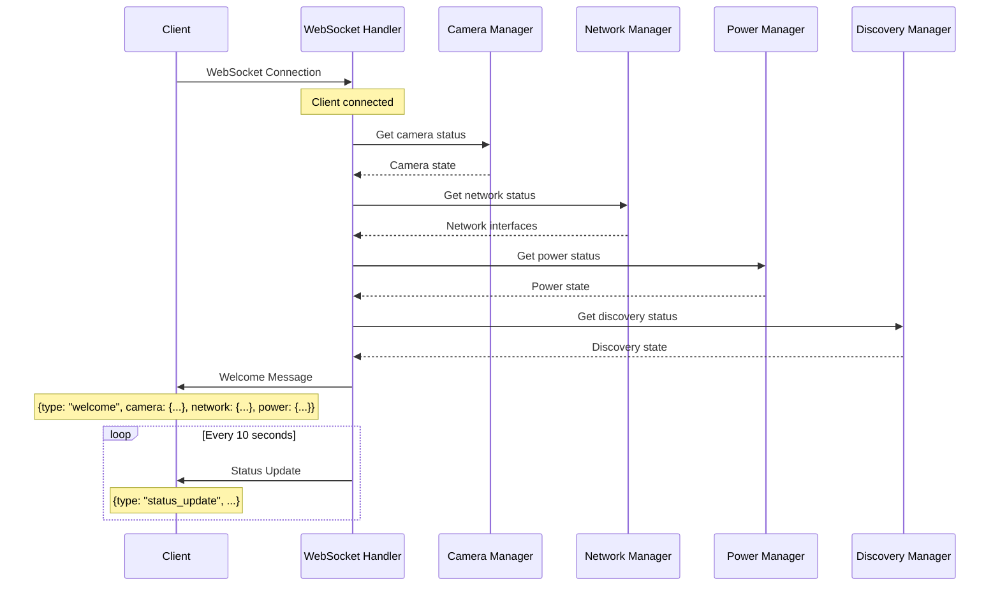

## Intervalometer Operations

### Start Intervalometer with Title (Complete Flow)

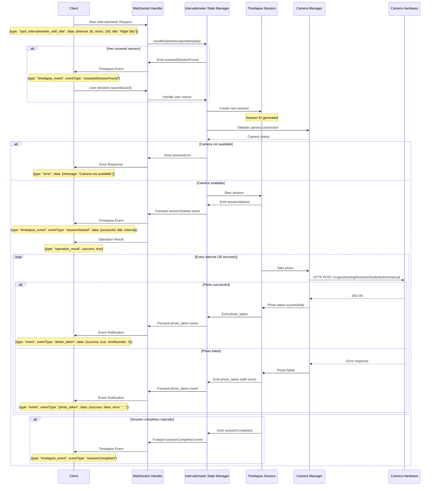

### Stop Intervalometer Flow

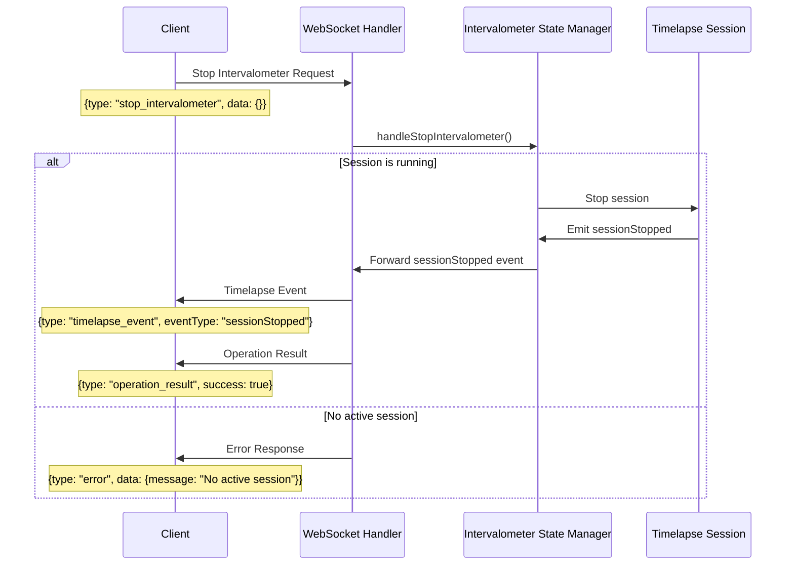

### Session Save/Discard Flow

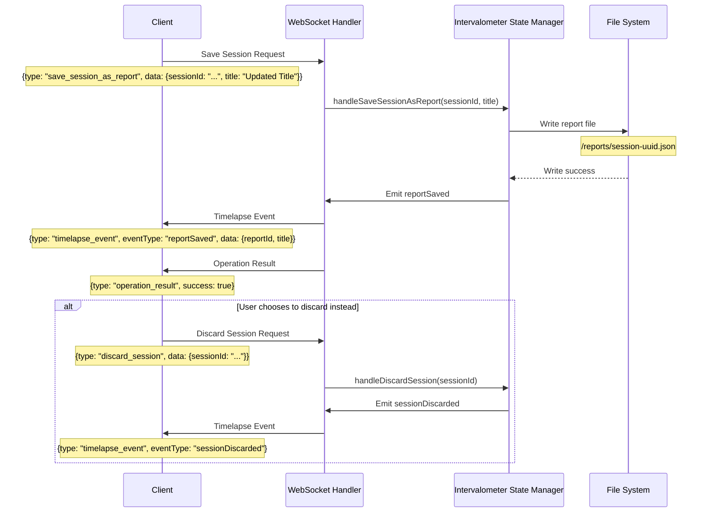

## Network Operations

### WiFi Connection Flow

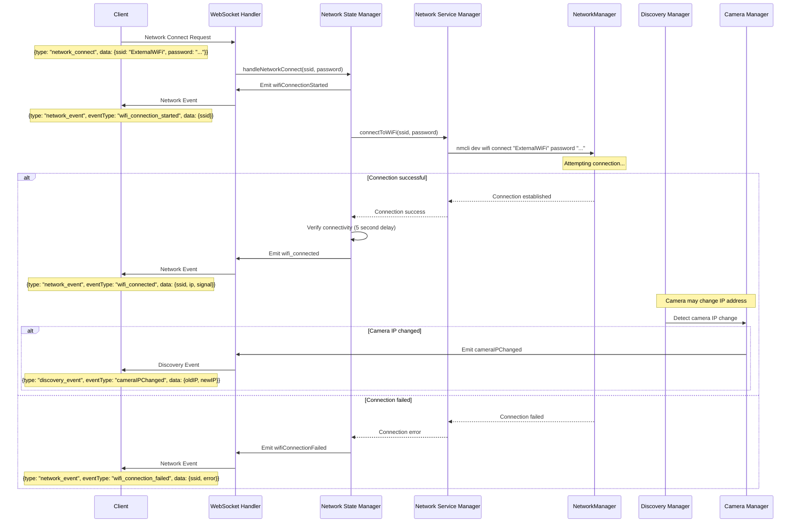

### WiFi Scan Flow

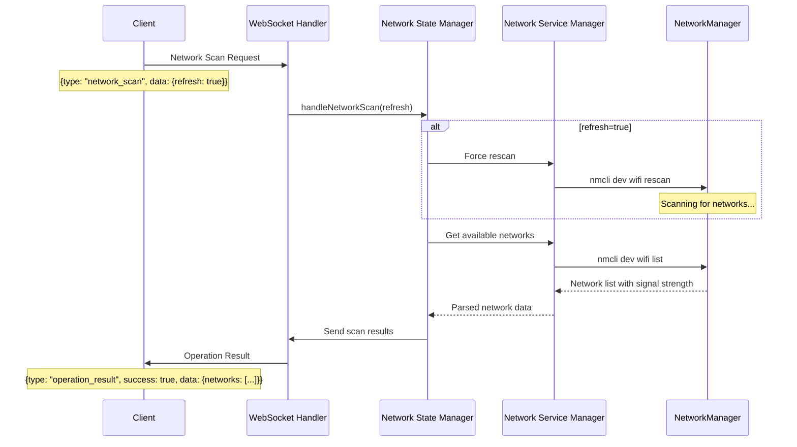

## Camera Discovery and Connection

### UPnP Camera Discovery Flow

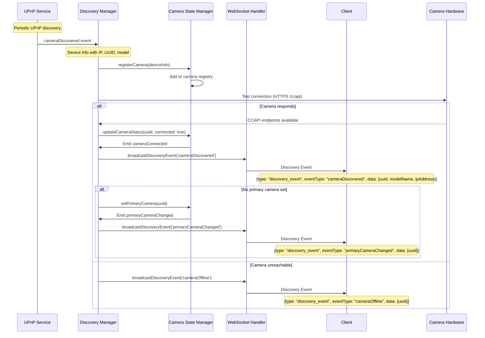

### Manual Camera Connection Flow

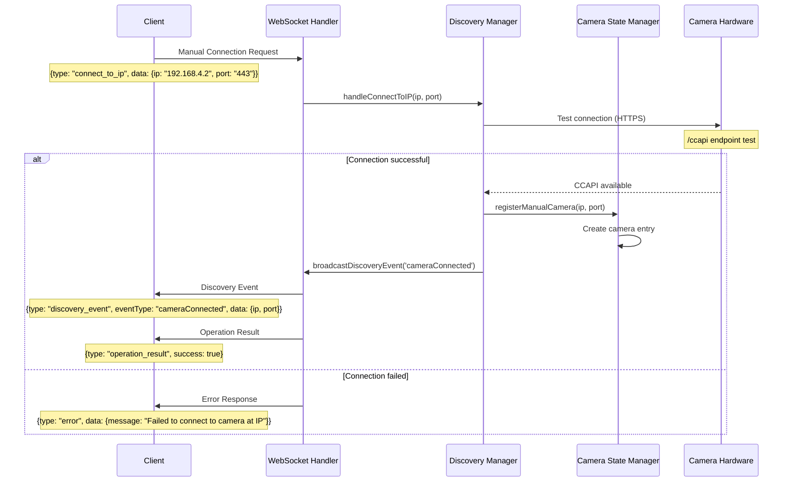

### Camera IP Change Detection

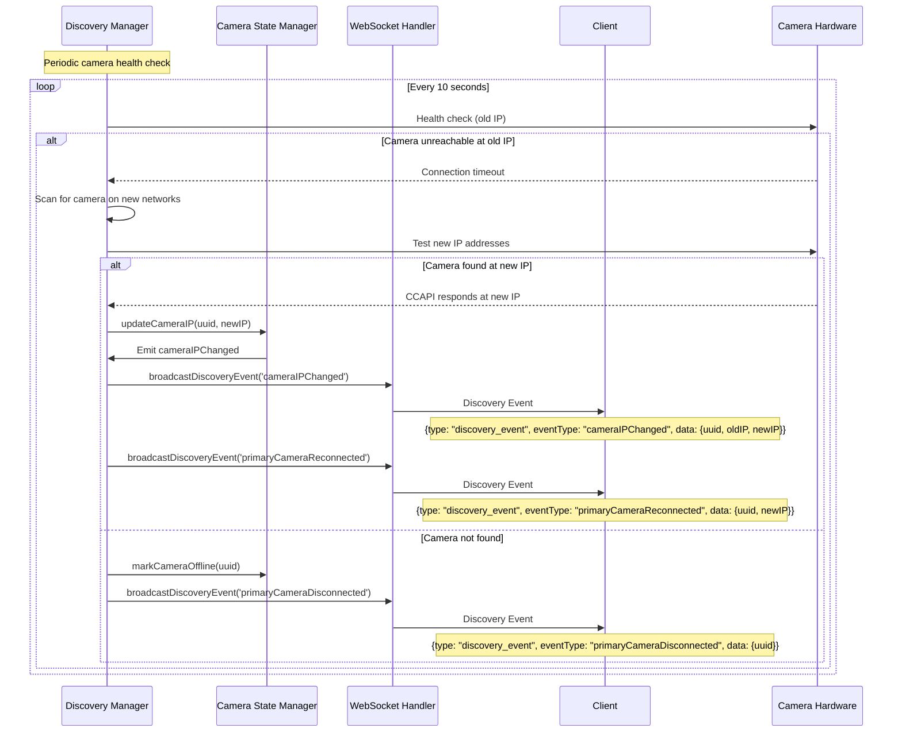

## Time Synchronization

### Client Time Synchronization Flow

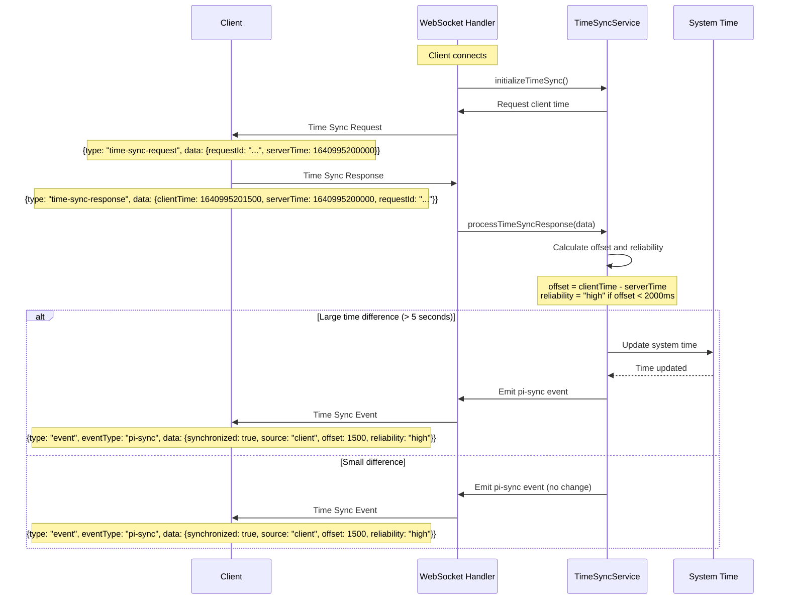

### Camera Time Synchronization Flow

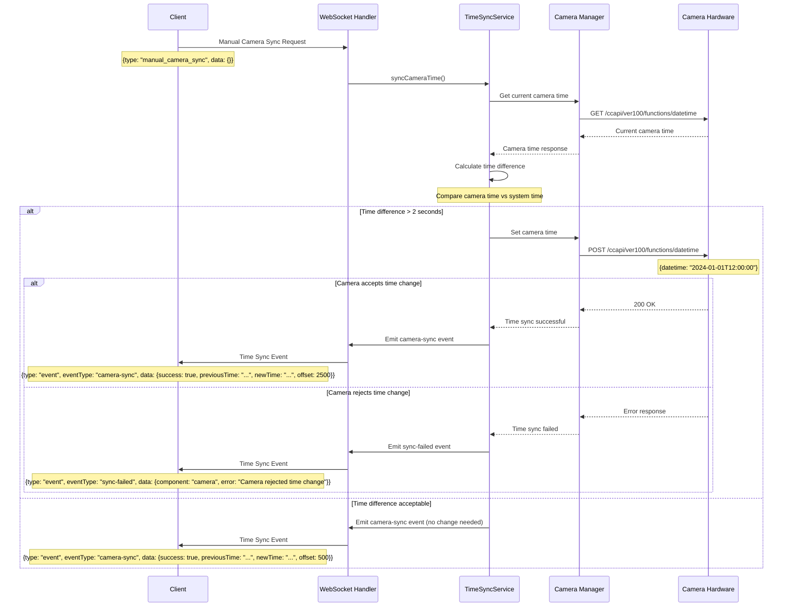

### GPS Time Synchronization Flow

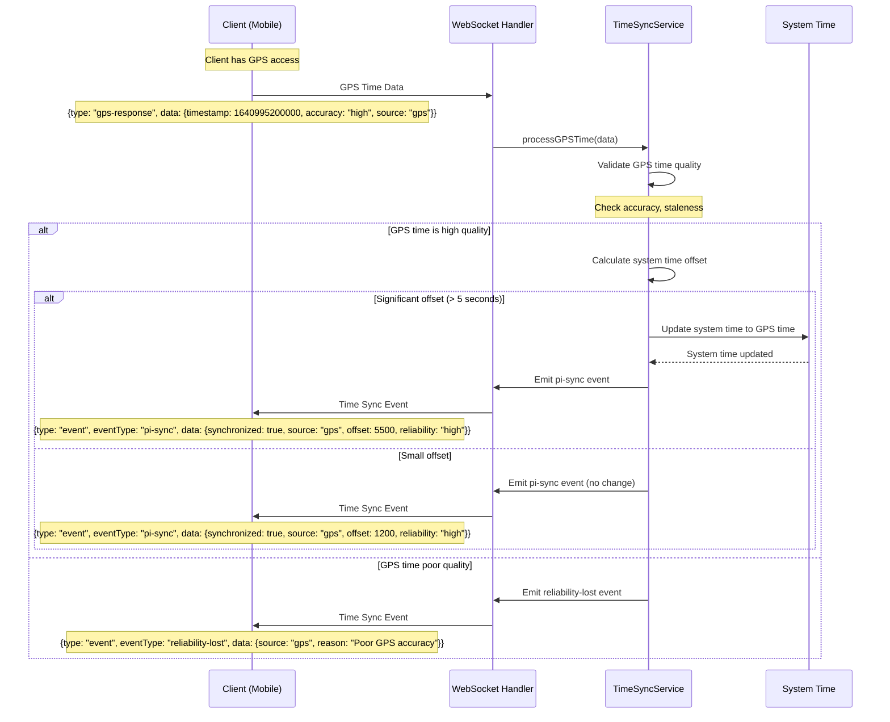

## Error Handling and Recovery

### Connection Error Recovery Flow

```mermaid
sequenceDiagram
    participant C as Client
    participant WS as WebSocket Handler
    participant DM as Discovery Manager
    participant CM as Camera Manager

    Note over WS: Periodic status check
    WS->>CM: Get camera status

    alt Camera connection lost
        CM-->>WS: Camera disconnected

        WS->>C: Status Update
        Note over C: {type: "status_update", camera: {connected: false}}

        WS->>DM: Trigger reconnection attempt

        loop Retry with exponential backoff
            DM->>CM: Attempt reconnection

            alt Reconnection successful
                CM-->>DM: Camera reconnected

                DM->>WS: broadcastDiscoveryEvent('primaryCameraReconnected')
                WS->>C: Discovery Event
                Note over C: {type: "discovery_event", eventType: "primaryCameraReconnected"}
                break

            else Reconnection failed
                Note over DM: Wait backoff period (5s, 10s, 20s, ...)
            end
        end
    end
```

### WebSocket Error Handling Flow

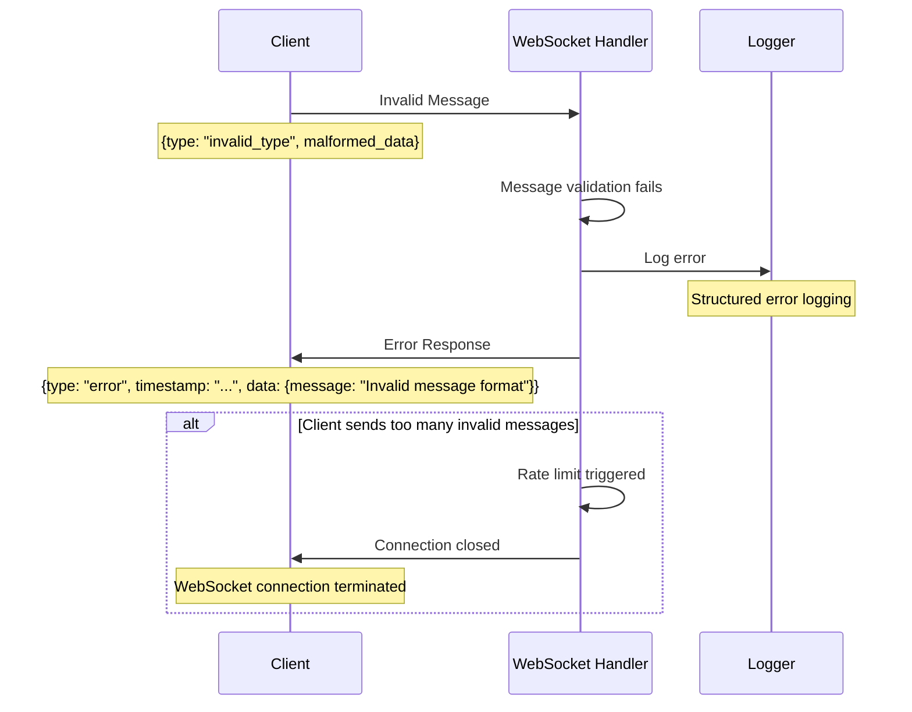
