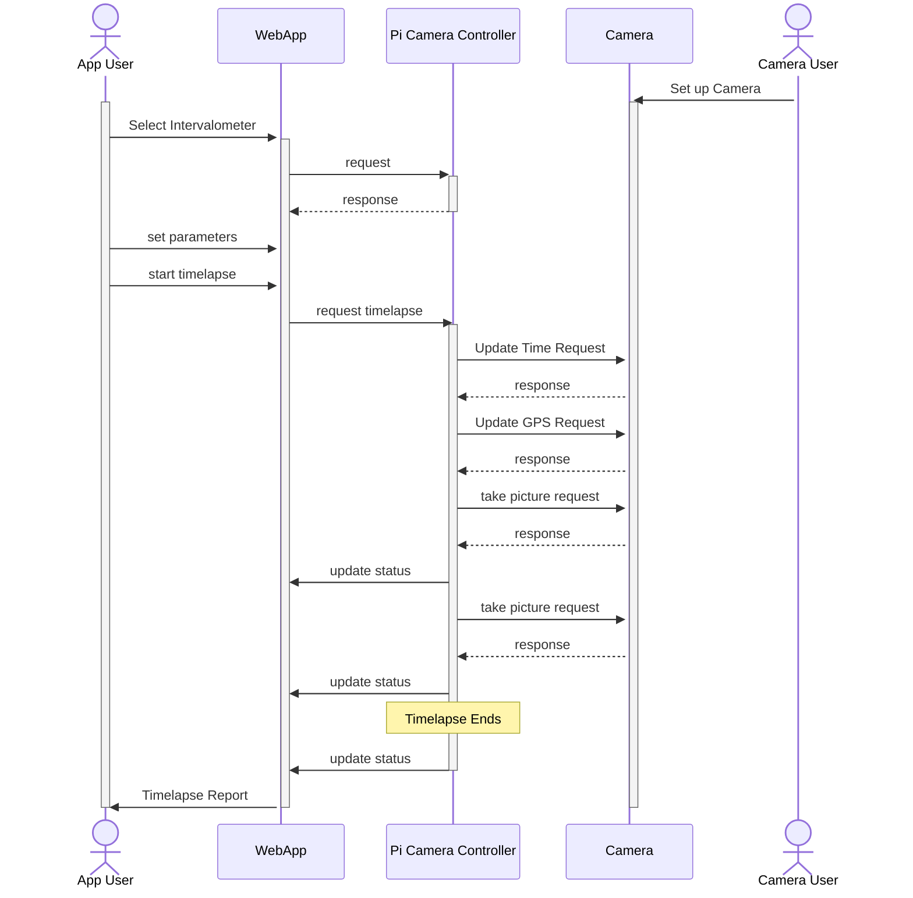

# Timelapse Record Improvements
I want to make some improvements to the timelapse record.

## Add to Data Saved in Record
When a timelapse starts, the pi-camera-controller should collect the following information 
from the client and make it part of the timelapse record:
* Intervalometer parameters:
  * interval (seconds between shots)
  * stop-condition (one of "unlimited", "stop-after" or "stop-at")
  * number-of-shots (integer, 0 = unlimited, calculate from stop-at if necessary)
  * stop-at (timestamp, null = unlimited, calculate from number-of-shots and interval if necessary)

When a timelapse starts, the pi-camera-controller should request the following information
from the camera and make it part of the timelapse record:
* All of the Camera information
  * "camera-info" field of record
* All of the Camera settings
  * "camera-settings" field of record

### Camera Information
Sequence diagram for `GET ./ccapi/ver100/deviceinformation` is in
`"CanonDocs/markdown/4.5 Camera Settings WIP.md"`

API Documentation for `GET ./ccapi/ver100/deviceinformation` is in 
`"CanonDocs/markdown/4.3. Camera Information (Fixed Values).md`

### Camera Settings

API Documentation for `GET http://192.168.1.2:8080/ccapi/ver100/shooting/settings`

section `4.9.1. Get all shooting parameters` of
`"CanonDocs/markdown/4.9. Shooting Settings WIP.md"`

# FUTURE Automated Camera Setup FUTURE

Needs more definition, do not start

This section is a work in progress. This section is not ready to use.
Do not consider this section in any decisions.
Do not implement anything in this section unless it is specified in
earlier sections.

When a timelapse is started

